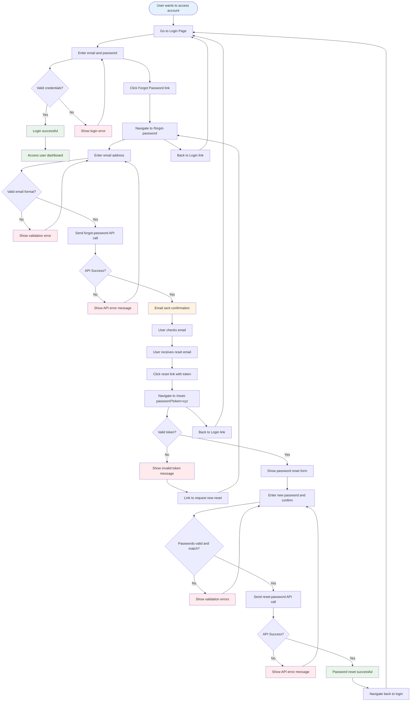

# Authentication Flow Documentation

This document describes the complete authentication flow including login, forgot password, and reset password processes implemented in the Loud Spectrum application.

## Overview

The authentication system consists of three main flows:

1. **Login Process** - Standard user authentication
2. **Forgot Password Process** - Password recovery initiation
3. **Reset Password Process** - Password reset completion

## Flow Diagram

### Visual Flow Chart

> **Note:** If the Mermaid diagram below doesn't render, check that your markdown viewer supports Mermaid diagrams. See the alternative text flow representation below.



### Alternative Text Flow (if diagram doesn't render)

```
Authentication Flow:

START → Login Page
├── Valid Login → Dashboard ✅
├── Invalid Login → Login Error → Back to Login Form
└── Forgot Password Link → Forgot Password Page
    ├── Invalid Email → Validation Error → Back to Email Form
    └── Valid Email → API Call
        ├── API Error → Error Message → Back to Email Form
        └── Success → Email Sent Confirmation → User Checks Email
            └── Reset Email Received → Click Reset Link → Reset Password Page
                ├── Invalid Token → Error Message → Request New Reset Link
                └── Valid Token → Password Reset Form
                    ├── Invalid Passwords → Validation Error → Back to Form
                    └── Valid Passwords → API Call
                        ├── API Error → Error Message → Back to Form
                        └── Success → Password Reset Complete ✅ → Back to Login
```

## Process Details

### 1. Login Process

**Route:** `/login`
**Component:** `components/auth/Login.jsx`
**API:** `/api/auth/login`

#### Flow Steps:

1. User navigates to login page
2. Enters email and password
3. Client-side validation using Zod schema
4. API call to authenticate user
5. On success: Store user data in Redux and redirect
6. On failure: Display error message

#### Key Features:

- Form validation with error display
- Password visibility toggle
- Loading states during authentication
- Toast notifications for success/failure
- Forgot password link integration

### 2. Forgot Password Process

**Route:** `/forgot-password`
**Component:** `components/auth/ForgotPassword.jsx`
**API:** `/api/auth/forgot-password` → External API `/forgot-password`

#### Flow Steps:

1. User clicks "Forgot Password?" link on login page
2. Navigates to forgot password page
3. Enters email address
4. Client-side email validation
5. API call to request password reset
6. Success confirmation displayed
7. User receives email with reset link

#### Key Features:

- Email format validation
- API error handling
- Success confirmation with visual feedback
- Navigation back to login
- Multi-language support

### 3. Reset Password Process

**Route:** `/reset-password?token=xyz`
**Component:** `components/auth/ResetPassword.jsx`
**API:** `/api/auth/reset-password` → External API `/reset-password`

#### Flow Steps:

1. User clicks reset link from email
2. Token extracted from URL parameters
3. Token validation check
4. If valid: Show password reset form
5. If invalid: Show error with option to request new reset
6. User enters new password and confirmation
7. Client-side validation (password strength, matching)
8. API call to reset password
9. Success confirmation and redirect to login

#### Key Features:

- Token-based security
- Password strength validation
- Password confirmation matching
- Show/hide password toggles
- Invalid token handling
- Success/error state management

## File Structure

### Pages

- `app/[locale]/(auth)/login/page.jsx` - Login page
- `app/[locale]/(auth)/forgot-password/page.jsx` - Forgot password page
- `app/[locale]/(auth)/reset-password/page.jsx` - Reset password page

### Components

- `components/auth/Login.jsx` - Login form component
- `components/auth/ForgotPassword.jsx` - Forgot password form
- `components/auth/ResetPassword.jsx` - Reset password form
- `components/auth/index.jsx` - Auth wrapper with tabs

### API Routes

- `app/api/auth/login/route.js` - Login API endpoint
- `app/api/auth/forgot-password/route.js` - Forgot password API endpoint
- `app/api/auth/reset-password/route.js` - Reset password API endpoint

### Validations

- `helpers/validations/login-validation.js` - Login form validation
- `helpers/validations/forgot-password-validation.js` - Forgot password validation
- `helpers/validations/reset-password-validation.js` - Reset password validation

### State Management

- `lib/store/slices/authSlice.js` - Authentication Redux slice

## Security Features

### Token-Based Reset

- Reset links contain secure tokens
- Tokens are validated before allowing password reset
- Invalid/expired tokens show appropriate error messages

### Password Security

- Minimum 6 character requirement
- Password confirmation validation
- Client-side validation before API calls

### API Security

- All API calls go through internal Next.js API routes
- External API calls are proxied for security
- Error handling prevents information leakage

## User Experience Features

### Multi-Language Support

Translations available in:

- English (en)
- Spanish (es)
- German (de)
- French (fr)
- Japanese (ja)
- Russian (ru)

### Responsive Design

- Works on all device sizes
- Consistent styling across components
- Mobile-friendly forms and navigation

### Loading States

- Loading indicators during API calls
- Disabled buttons during processing
- Toast notifications for feedback

### Error Handling

- Client-side validation errors
- API error messages
- User-friendly error states
- Recovery options for all error scenarios

## Integration Points

### Redux Store

- Authentication state management
- User data persistence
- Loading and error states

### Internationalization

- Next-intl integration
- Locale-based routing
- Translation key management

### Toast Notifications

- Sonner integration
- Success/error feedback
- Consistent messaging

## Usage Examples

### Triggering Forgot Password

```jsx
<Link href="/forgot-password" className="text-umbra-100 hover:text-umbra-60">
  {t('forgot_password')}
</Link>
```

### API Integration

```javascript
const response = await fetch('/api/auth/forgot-password', {
  method: 'POST',
  headers: { 'Content-Type': 'application/json' },
  body: JSON.stringify({ email }),
});
```

### Validation Usage

```javascript
import { validateResetPassword } from '@/helpers/validations/reset-password-validation';

const validation = validateResetPassword(formData);
if (!validation.success) {
  // Handle validation errors
}
```

## Testing Considerations

### Test Scenarios

1. **Valid login flow**
2. **Invalid credentials handling**
3. **Forgot password with valid email**
4. **Forgot password with invalid email**
5. **Reset password with valid token**
6. **Reset password with invalid token**
7. **Password validation edge cases**
8. **Network error handling**

### Error Scenarios

1. **Network connectivity issues**
2. **Invalid/expired tokens**
3. **API server errors**
4. **Client-side validation failures**
5. **Concurrent reset requests**

## Future Enhancements

### Potential Improvements

1. **Password strength indicator**
2. **Two-factor authentication**
3. **Social login integration**
4. **Remember me functionality**
5. **Account lockout protection**
6. **Email verification**
7. **Password history**
8. **Security notifications**

---

_Last updated: Current implementation includes complete forgot/reset password flow with multi-language support and comprehensive error handling._
