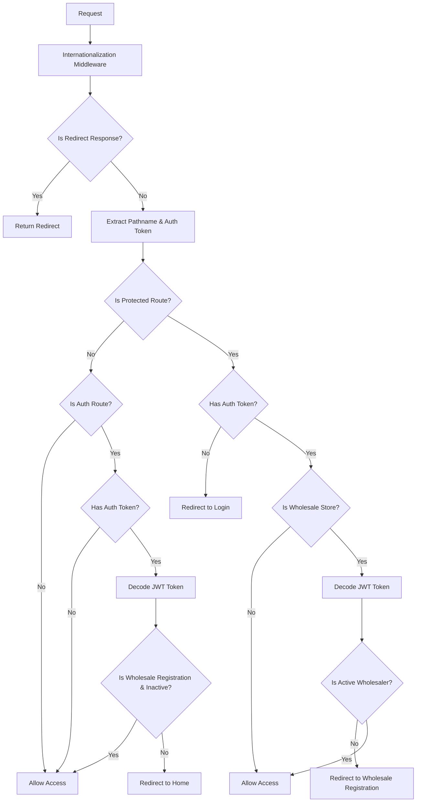

# Middleware Documentation

## Overview

This middleware combines internationalization (i18n) with route protection to handle user authentication and authorization across the application. It ensures that users can only access routes they're authorized to view based on their authentication status and role.

## Key Features

- **Internationalization**: Handles locale-based routing using `next-intl`
- **Route Protection**: Protects certain routes from unauthorized access
- **Role-based Access Control**: Different access levels for regular users and wholesalers
- **Authentication State Management**: Redirects users based on their login status
- **JWT Token Validation**: Decodes and validates authentication tokens

## Route Configuration

### Protected Routes

Routes that require authentication:

- `/checkout` - Shopping cart checkout process
- `/account` - User account management
- `/wholesale-store` - Wholesale store (requires active wholesaler status)

### Auth Routes

Routes that should not be accessible when logged in:

- `/login` - User login page
- `/register` - User registration page
- `/wholesaler-registration` - Wholesale registration page

## User Access Matrix

| User Type               | Public Routes | /checkout     | /account      | /wholesale-store               | Auth Routes                         | /wholesale-registration                  |
| ----------------------- | ------------- | ------------- | ------------- | ------------------------------ | ----------------------------------- | ---------------------------------------- |
| **Anonymous**           | ✅            | ❌ → `/login` | ❌ → `/login` | ❌ → `/login`                  | ✅                                  | ✅ (Shows registration form)             |
| **Regular User**        | ✅            | ✅            | ✅            | ❌ → `/wholesale-registration` | ❌ → `/`                            | ✅ (Shows registration form)             |
| **Inactive Wholesaler** | ✅            | ✅            | ✅            | ❌ → `/wholesale-registration` | ✅ (`/wholesale-registration` only) | ✅ (Shows "waiting for approval" status) |
| **Active Wholesaler**   | ✅            | ✅            | ✅            | ✅                             | ❌ → `/`                            | ❌ → `/` (Already approved)              |

## Wholesale Registration Page Behavior

The `/wholesale-registration` page has special client-side logic that renders different content based on user status:

### For Inactive Wholesalers (Under Review)

When an inactive wholesaler accesses `/wholesale-registration`, the page shows:

- **Waiting for Approval Message**: Instead of the registration form
- **User Details**: Display of submitted registration information
- **Status Badge**: Shows current status (Waiting For Approve/Inactive)
- **Next Steps**: Information about the approval process

### For Other Users

- **Anonymous Users**: See the full registration form
- **Regular Users**: See the full registration form (can apply to become wholesaler)
- **Active Wholesalers**: Redirected to home page by middleware

### Key Features

- **Auto-scroll**: Supports `#wholesale-form` hash for smooth scrolling
- **Dynamic Content**: Renders different UI based on authentication state
- **Status Display**: Shows comprehensive registration details for pending users

## Middleware Flow



## Code Structure

### Main Components

1. **Internationalization Setup**

   ```javascript
   const intlMiddleware = createMiddleware(routing);
   ```

2. **Route Protection Logic**

   ```javascript
   const protectedRoutes = ['/checkout', '/account', '/wholesale-store'];
   const authRoutes = ['/login', '/register', '/wholesaler-registration'];
   ```

3. **JWT Token Handling**
   ```javascript
   const tokenPayload = JSON.parse(atob(authToken.split('.')[1]));
   ```

### Key Functions

- **Locale Removal**: Strips locale prefix from pathname for route checking
- **Token Validation**: Decodes JWT tokens to extract user information
- **Role Verification**: Checks user roles and status for authorization
- **Redirect Management**: Handles redirects based on access rules

## Wholesaler Status Handling

The middleware handles different wholesaler statuses:

- **No Role/Regular User**: Can access all routes except wholesale store
- **Inactive Wholesaler**: Can access all routes except wholesale store, can stay on wholesale registration
- **Active Wholesaler**: Can access all routes including wholesale store

## Error Handling

The middleware includes comprehensive error handling:

1. **JWT Decoding Errors**: Invalid tokens are caught and handled appropriately
2. **Missing Tokens**: Redirects to login for protected routes
3. **Invalid User States**: Graceful fallbacks for unexpected user states

## Configuration

### Matcher Configuration

```javascript
export const config = {
  matcher: '/((?!api|trpc|_next|_vercel|.*\\..*).*)',
};
```

This configuration ensures the middleware runs on all routes except:

- API routes (`/api/*`)
- tRPC routes (`/trpc/*`)
- Next.js internal routes (`/_next/*`)
- Vercel routes (`/_vercel/*`)
- Static files (files with extensions)

## Debugging

### Console Logs

The middleware includes helpful console logs for debugging:

- `Access denied: No auth token found for protected route`
- `Redirecting inactive wholesaler to registration page`
- `Access denied: User is not an active wholesaler`
- `Redirecting logged-in user from auth route`

### Common Issues

1. **Infinite Redirects**: Check if protected routes are correctly defined
2. **Token Decoding Errors**: Ensure JWT tokens are properly formatted
3. **Locale Issues**: Verify locale patterns match your i18n configuration

## Testing Scenarios

### Test Cases to Verify

1. **Anonymous User**

   - Can access public routes
   - Redirected to login when accessing protected routes
   - Can access auth routes

2. **Regular User**

   - Can access all routes except wholesale store
   - Redirected from auth routes to home
   - Can complete checkout and manage account

3. **Inactive Wholesaler**

   - Can access all routes except wholesale store
   - Can access wholesale registration page
   - Redirected from wholesale store to registration
   - Shows "waiting for approval" status on registration page

4. **Active Wholesaler**
   - Can access all routes including wholesale store
   - Redirected from auth routes to home
   - Full access to wholesale features

### Special Test Case: Wholesaler Under Review

**Scenario**: Inactive wholesaler accesses `/wholesale-registration`

- **Expected**: Page renders "waiting for approval" message instead of form
- **Displays**: User details, status badge, next steps information
- **No Form**: Registration form is hidden
- **Status**: Shows current approval status (Waiting For Approve/Inactive)

## Maintenance

### Adding New Protected Routes

1. Add route to `protectedRoutes` array
2. Test with different user types
3. Update documentation

### Adding New Auth Routes

1. Add route to `authRoutes` array
2. Consider special cases for different user types
3. Test redirect logic

### Modifying Wholesaler Logic

1. Update JWT token handling
2. Test all wholesaler status scenarios
3. Verify redirect flows

## Related Files

- `i18n/routing.js` - Internationalization configuration
- `app/actions/auth.js` - Authentication actions
- `lib/store/slices/authSlice.js` - Authentication state management

## Security Considerations

- JWT tokens are validated on each request
- Sensitive routes are protected at the middleware level
- User roles are verified server-side
- Redirect URLs are validated to prevent open redirects
