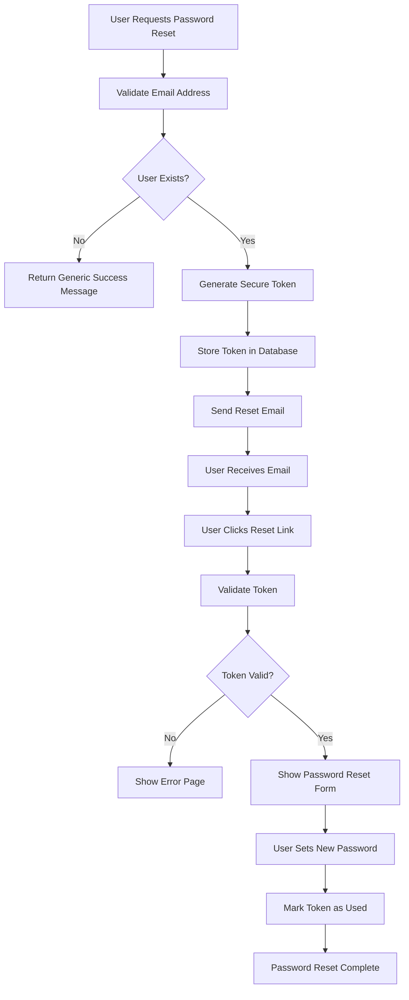

# Authentication Email Flow Documentation

## Overview

The Authentication Email System handles password reset functionality for user accounts. It provides a secure, branded email template that allows users to reset their passwords through a token-based verification system.

## System Architecture

The authentication email system consists of a single email type focused on password reset functionality with secure token handling.

### Files Structure

```
app/api/emails/auth/
└── forget-password/
    └── route.js                    # Password reset API endpoint

components/emails/
└── ForgotPasswordEmail.jsx         # Password reset email template
```

## Email Type & Flow

### Forgot Password Email

**Triggered**: When user requests password reset
**Purpose**: Provide secure password reset link with token
**Visual Theme**: Blue/Brand colors (security focused)
**Security Features**: Token-based authentication, expiration warnings

## API Usage

### Endpoint

```
POST /api/emails/auth/forget-password
```

### Request Structure

```javascript
{
  "email": "user@example.com",
  "token": "secure_reset_token_here",
  "locale": "en" // Optional, defaults to English
}
```

### Response Structure

```javascript
// Success
{
  "success": true,
  "message": "Your message has been sent.",
  "emailId": "resend_email_id"
}

// Error
{
  "success": false,
  "message": "Email and reset token are required",
  "details": "Specific error details"
}
```

## Implementation Examples

### Basic Password Reset Flow

```javascript
const sendPasswordResetEmail = async (userEmail, resetToken, userLocale = 'en') => {
  try {
    const response = await fetch('/api/emails/auth/forget-password', {
      method: 'POST',
      headers: { 'Content-Type': 'application/json' },
      body: JSON.stringify({
        email: userEmail,
        token: resetToken,
        locale: userLocale,
      }),
    });

    const result = await response.json();

    if (result.success) {
      console.log('Password reset email sent successfully:', result.emailId);
      return { success: true, emailId: result.emailId };
    } else {
      console.error('Failed to send password reset email:', result.message);
      return { success: false, error: result.message };
    }
  } catch (error) {
    console.error('Error sending password reset email:', error);
    return { success: false, error: error.message };
  }
};
```

### Complete Authentication System Integration

```javascript
// In your authentication service
class AuthService {
  async initiatePasswordReset(email) {
    try {
      // 1. Validate user exists
      const user = await this.findUserByEmail(email);
      if (!user) {
        throw new Error('User not found');
      }

      // 2. Generate secure reset token
      const resetToken = this.generateSecureToken();
      const expirationTime = new Date(Date.now() + 60 * 60 * 1000); // 1 hour

      // 3. Store token in database
      await this.storeResetToken(user.id, resetToken, expirationTime);

      // 4. Send password reset email
      const emailResult = await this.sendPasswordResetEmail(user.email, resetToken, user.locale || 'en');

      if (!emailResult.success) {
        throw new Error('Failed to send reset email');
      }

      return {
        success: true,
        message: 'Password reset email sent successfully',
      };
    } catch (error) {
      console.error('Password reset initiation failed:', error);
      return {
        success: false,
        error: error.message,
      };
    }
  }

  generateSecureToken() {
    return crypto.randomBytes(32).toString('hex');
  }

  async storeResetToken(userId, token, expirationTime) {
    // Store in your database
    await db.passwordResetTokens.create({
      user_id: userId,
      token: token,
      expires_at: expirationTime,
      used: false,
    });
  }

  async validateResetToken(token) {
    const tokenRecord = await db.passwordResetTokens.findOne({
      where: {
        token: token,
        used: false,
        expires_at: { $gt: new Date() },
      },
    });

    return tokenRecord !== null;
  }
}
```

## Email Template Features

### Security-Focused Design

- **Professional Branding**: Loud Spectrum gradient logo and brand colors
- **Clear Security Messaging**: Prominent indication of password reset request
- **Token-Based Authentication**: Secure reset link with embedded token
- **Expiration Warning**: Clear 1-hour expiration notice
- **Unauthorized Request Warning**: Security notice for unintended requests

### User Experience Features

- **Responsive Design**: Works across all email clients and devices
- **Accessibility**: Alternative text for images and clear link descriptions
- **Multiple Access Methods**: Both button and copy-paste link options
- **Support Information**: Help section with contact details
- **Professional Typography**: Space Grotesk font with fallbacks

### Content Structure

1. **Header**: Branded logo with gradient styling
2. **Alert Banner**: Clear "Password Reset Request" indication
3. **Personal Greeting**: Uses recipient's email for personalization
4. **Reset Button**: Prominent call-to-action with secure link
5. **Alternative Link**: Copy-paste option for accessibility
6. **Security Notice**: Warning about unauthorized requests
7. **Important Information**: Expiration time and usage guidelines
8. **Help Section**: Support contact information
9. **Footer**: Company information and branding

## Integration Workflow

### Password Reset Process Flow



### Frontend Integration Example

```javascript
// Password reset request form
const PasswordResetForm = () => {
  const [email, setEmail] = useState('');
  const [loading, setLoading] = useState(false);
  const [message, setMessage] = useState('');

  const handleSubmit = async (e) => {
    e.preventDefault();
    setLoading(true);

    try {
      const response = await fetch('/api/auth/forgot-password', {
        method: 'POST',
        headers: { 'Content-Type': 'application/json' },
        body: JSON.stringify({ email }),
      });

      const result = await response.json();

      if (result.success) {
        setMessage('If an account with that email exists, a password reset link has been sent.');
      } else {
        setMessage('An error occurred. Please try again.');
      }
    } catch (error) {
      setMessage('An error occurred. Please try again.');
    } finally {
      setLoading(false);
    }
  };

  return (
    <form onSubmit={handleSubmit}>
      <input
        type="email"
        value={email}
        onChange={(e) => setEmail(e.target.value)}
        placeholder="Enter your email address"
        required
      />
      <button type="submit" disabled={loading}>
        {loading ? 'Sending...' : 'Send Reset Link'}
      </button>
      {message && <p>{message}</p>}
    </form>
  );
};
```

## Security Considerations

### Token Security

- **Cryptographically Secure**: Use crypto.randomBytes() for token generation
- **Limited Lifetime**: 1-hour expiration to minimize exposure
- **Single Use**: Tokens are marked as used after successful reset
- **Secure Storage**: Hash tokens before storing in database

### Email Security

- **Generic Response**: Don't reveal if email exists in system
- **Rate Limiting**: Implement request limits to prevent abuse
- **Logging**: Log all password reset attempts for security monitoring
- **HTTPS Only**: Ensure reset links use HTTPS protocol

### Best Practices

```javascript
// Secure token generation
const generateResetToken = () => {
  return crypto.randomBytes(32).toString('hex');
};

// Hash token before storage
const hashToken = (token) => {
  return crypto.createHash('sha256').update(token).digest('hex');
};

// Rate limiting middleware
const rateLimiter = rateLimit({
  windowMs: 15 * 60 * 1000, // 15 minutes
  max: 5, // Limit each IP to 5 requests per windowMs
  message: 'Too many password reset attempts, please try again later.',
});
```

## Environment Variables

Required environment variables:

```env
# Resend Configuration
RESEND_API_KEY=your_resend_api_key
RESEND_FROM_EMAIL=noreply@loudspectrum.com

# Application URLs
NEXT_PUBLIC_BASE_URL_EMAIL=https://yourdomain.com

# Security
JWT_SECRET=your_jwt_secret_for_tokens
PASSWORD_RESET_EXPIRY=3600 # 1 hour in seconds
```

## Error Handling

### API Error Responses

```javascript
// Missing required fields
{
  "success": false,
  "message": "Email and reset token are required"
}

// Email sending failure
{
  "success": false,
  "message": "Failed to send email",
  "details": "Specific error from email service"
}

// Internal server error
{
  "success": false,
  "message": "Internal server error"
}
```

### Client-Side Error Handling

```javascript
const handlePasswordReset = async (email) => {
  try {
    const response = await fetch('/api/emails/auth/forget-password', {
      method: 'POST',
      headers: { 'Content-Type': 'application/json' },
      body: JSON.stringify({
        email,
        token: resetToken,
        locale: userLocale,
      }),
    });

    if (!response.ok) {
      const errorData = await response.json();
      throw new Error(errorData.message || 'Failed to send reset email');
    }

    const result = await response.json();
    return result;
  } catch (error) {
    console.error('Password reset error:', error);
    throw error;
  }
};
```

## Testing

### Manual Testing

```bash
# Test password reset email
curl -X POST http://localhost:3000/api/emails/auth/forget-password \
  -H "Content-Type: application/json" \
  -d '{
    "email": "test@example.com",
    "token": "test_token_123",
    "locale": "en"
  }'
```

### Automated Testing

```javascript
// Jest test example
describe('Password Reset Email', () => {
  test('should send password reset email successfully', async () => {
    const mockEmailData = {
      email: 'test@example.com',
      token: 'secure_token_123',
      locale: 'en',
    };

    const response = await request(app).post('/api/emails/auth/forget-password').send(mockEmailData).expect(200);

    expect(response.body.success).toBe(true);
    expect(response.body.emailId).toBeDefined();
  });

  test('should fail with missing email', async () => {
    const response = await request(app)
      .post('/api/emails/auth/forget-password')
      .send({ token: 'test_token' })
      .expect(400);

    expect(response.body.success).toBe(false);
    expect(response.body.message).toContain('Email and reset token are required');
  });
});
```

## Monitoring & Analytics

### Key Metrics to Track

- **Email Delivery Rate**: Percentage of successfully delivered emails
- **Open Rate**: How many users open the reset email
- **Click-Through Rate**: Users who click the reset link
- **Completion Rate**: Users who complete password reset
- **Time to Reset**: Average time from email to password reset

### Logging Implementation

```javascript
// Enhanced logging for password reset flow
const logPasswordResetAttempt = (email, success, error = null) => {
  const logData = {
    event: 'password_reset_email',
    email: hashEmail(email), // Hash for privacy
    success,
    timestamp: new Date().toISOString(),
    error: error?.message || null,
  };

  console.log(JSON.stringify(logData));

  // Send to analytics service
  analytics.track('Password Reset Email Sent', logData);
};
```

## Customization

### Email Content Customization

```javascript
// Customize email content based on locale
const getLocalizedContent = (locale) => {
  const content = {
    en: {
      subject: 'Reset Your Password',
      greeting: 'Hi there',
      message: 'You requested a password reset...',
    },
    es: {
      subject: 'Restablece tu Contraseña',
      greeting: 'Hola',
      message: 'Solicitaste restablecer tu contraseña...',
    },
  };

  return content[locale] || content.en;
};
```

### Branding Customization

- Update logo URLs in the email template
- Modify color scheme in Tailwind config
- Customize company information in footer
- Adjust typography and spacing

## Best Practices

### Security Best Practices

1. **Always use HTTPS** for reset links
2. **Implement rate limiting** to prevent abuse
3. **Use cryptographically secure** token generation
4. **Set short expiration times** for tokens
5. **Log all attempts** for security monitoring

### User Experience Best Practices

1. **Clear messaging** about what the email is for
2. **Prominent reset button** for easy access
3. **Alternative access methods** for accessibility
4. **Professional branding** to build trust
5. **Support information** for user assistance

### Technical Best Practices

1. **Validate all inputs** before processing
2. **Handle errors gracefully** with user-friendly messages
3. **Implement proper logging** for debugging
4. **Test across email clients** for compatibility
5. **Monitor delivery rates** and performance

This authentication email system provides a secure, user-friendly password reset experience while maintaining professional branding and following security best practices.
