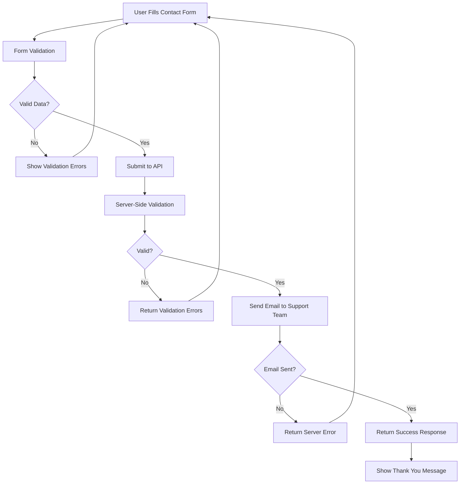
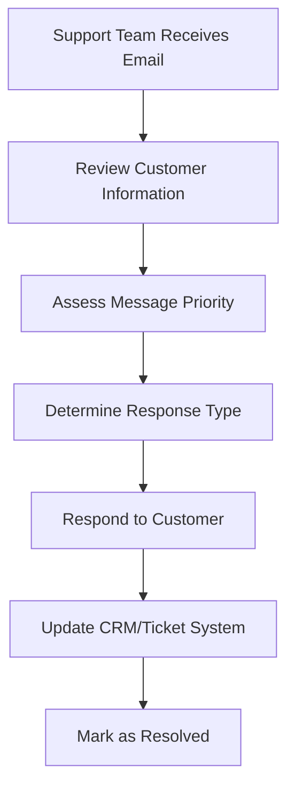

# Contact Form Email Flow Documentation

## Overview

The Contact Form Email System handles customer inquiries and messages submitted through the website's contact form. It processes form submissions, validates the data, and sends formatted emails to the support team with customer information and messages.

## System Architecture

The contact email system processes customer inquiries and forwards them to the support team with proper validation and formatting.

### Files Structure

```
app/api/emails/contact/
└── route.js                        # Contact form submission API endpoint

components/emails/
└── ContactSubmissionEmail.jsx       # Contact form email template

helpers/validations/
└── contact-validation.js            # Contact form validation logic
```

## Email Type & Flow

### Contact Submission Email

**Triggered**: When customer submits contact form
**Purpose**: Forward customer inquiry to support team
**Recipients**: Support team (info@medicalterpenes.com)
**Visual Theme**: Professional/Brand colors
**Features**: Customer information display, message formatting, subscription status

## API Usage

### Endpoint

```
POST /api/emails/contact
```

### Request Structure

```javascript
{
  "name": "John Doe",
  "email": "john@example.com",
  "message": "I have a question about your products...",
  "is_subscriber": true // Optional, indicates newsletter subscription
}
```

### Response Structure

```javascript
// Success
{
  "success": true,
  "message": "Your message has been sent.",
  "emailId": "resend_email_id"
}

// Validation Error
{
  "success": false,
  "errors": {
    "name": ["Name is required"],
    "email": ["Please enter a valid email address"],
    "message": ["Message must be at least 10 characters"]
  }
}

// Server Error
{
  "success": false,
  "message": "Failed to send email",
  "details": "Specific error details"
}
```

## Implementation Examples

### Basic Contact Form Submission

```javascript
const submitContactForm = async (formData) => {
  try {
    const response = await fetch('/api/emails/contact', {
      method: 'POST',
      headers: { 'Content-Type': 'application/json' },
      body: JSON.stringify({
        name: formData.name,
        email: formData.email,
        message: formData.message,
        is_subscriber: formData.isSubscriber || false,
      }),
    });

    const result = await response.json();

    if (result.success) {
      console.log('Contact form submitted successfully:', result.emailId);
      return { success: true, emailId: result.emailId };
    } else {
      console.error('Contact form submission failed:', result.errors || result.message);
      return { success: false, errors: result.errors || result.message };
    }
  } catch (error) {
    console.error('Error submitting contact form:', error);
    return { success: false, error: error.message };
  }
};
```

### React Contact Form Component

```javascript
import { useState } from 'react';

const ContactForm = () => {
  const [formData, setFormData] = useState({
    name: '',
    email: '',
    message: '',
    isSubscriber: false,
  });
  const [loading, setLoading] = useState(false);
  const [errors, setErrors] = useState({});
  const [success, setSuccess] = useState(false);

  const handleChange = (e) => {
    const { name, value, type, checked } = e.target;
    setFormData((prev) => ({
      ...prev,
      [name]: type === 'checkbox' ? checked : value,
    }));

    // Clear error when user starts typing
    if (errors[name]) {
      setErrors((prev) => ({ ...prev, [name]: null }));
    }
  };

  const handleSubmit = async (e) => {
    e.preventDefault();
    setLoading(true);
    setErrors({});

    try {
      const response = await fetch('/api/emails/contact', {
        method: 'POST',
        headers: { 'Content-Type': 'application/json' },
        body: JSON.stringify({
          name: formData.name,
          email: formData.email,
          message: formData.message,
          is_subscriber: formData.isSubscriber,
        }),
      });

      const result = await response.json();

      if (result.success) {
        setSuccess(true);
        setFormData({ name: '', email: '', message: '', isSubscriber: false });
      } else {
        if (result.errors) {
          setErrors(result.errors);
        } else {
          setErrors({ general: result.message });
        }
      }
    } catch (error) {
      setErrors({ general: 'An error occurred. Please try again.' });
    } finally {
      setLoading(false);
    }
  };

  if (success) {
    return (
      <div className="success-message">
        <h3>Thank you for your message!</h3>
        <p>We'll get back to you as soon as possible.</p>
        <button onClick={() => setSuccess(false)}>Send Another Message</button>
      </div>
    );
  }

  return (
    <form onSubmit={handleSubmit} className="contact-form">
      <div className="form-group">
        <label htmlFor="name">Name *</label>
        <input
          type="text"
          id="name"
          name="name"
          value={formData.name}
          onChange={handleChange}
          required
          className={errors.name ? 'error' : ''}
        />
        {errors.name && <span className="error-text">{errors.name[0]}</span>}
      </div>

      <div className="form-group">
        <label htmlFor="email">Email *</label>
        <input
          type="email"
          id="email"
          name="email"
          value={formData.email}
          onChange={handleChange}
          required
          className={errors.email ? 'error' : ''}
        />
        {errors.email && <span className="error-text">{errors.email[0]}</span>}
      </div>

      <div className="form-group">
        <label htmlFor="message">Message *</label>
        <textarea
          id="message"
          name="message"
          value={formData.message}
          onChange={handleChange}
          rows={5}
          required
          className={errors.message ? 'error' : ''}
        />
        {errors.message && <span className="error-text">{errors.message[0]}</span>}
      </div>

      <div className="form-group">
        <label className="checkbox-label">
          <input type="checkbox" name="isSubscriber" checked={formData.isSubscriber} onChange={handleChange} />
          Subscribe to our newsletter for updates and offers
        </label>
      </div>

      {errors.general && <div className="error-message">{errors.general}</div>}

      <button type="submit" disabled={loading}>
        {loading ? 'Sending...' : 'Send Message'}
      </button>
    </form>
  );
};

export default ContactForm;
```

## Email Template Features

### Professional Design

- **Clean Layout**: Well-structured presentation of customer information
- **Brand Consistency**: Loud Spectrum branding and color scheme
- **Easy Scanning**: Organized sections for quick information review
- **Contact Details**: Prominent display of customer contact information

### Information Display

- **Customer Details**: Name, email, and subscription status
- **Message Content**: Formatted message with proper spacing
- **Submission Time**: Timestamp for tracking purposes
- **Priority Indicators**: Visual cues for urgent messages

### Content Structure

1. **Header**: Professional subject line with customer name
2. **Customer Information**: Name, email, subscription status
3. **Message Section**: Customer's inquiry or message
4. **Action Items**: Next steps for support team
5. **Footer**: Company branding and contact information

## Validation System

### Contact Form Validation Rules

```javascript
// helpers/validations/contact-validation.js
export const validateContact = ({ name, email, message, is_subscriber }) => {
  const errors = {};

  // Name validation
  if (!name || name.trim().length === 0) {
    errors.name = ['Name is required'];
  } else if (name.trim().length < 2) {
    errors.name = ['Name must be at least 2 characters'];
  } else if (name.trim().length > 100) {
    errors.name = ['Name must be less than 100 characters'];
  }

  // Email validation
  if (!email || email.trim().length === 0) {
    errors.email = ['Email is required'];
  } else if (!isValidEmail(email)) {
    errors.email = ['Please enter a valid email address'];
  }

  // Message validation
  if (!message || message.trim().length === 0) {
    errors.message = ['Message is required'];
  } else if (message.trim().length < 10) {
    errors.message = ['Message must be at least 10 characters'];
  } else if (message.trim().length > 5000) {
    errors.message = ['Message must be less than 5000 characters'];
  }

  // Subscription status validation (optional)
  if (is_subscriber !== undefined && typeof is_subscriber !== 'boolean') {
    errors.is_subscriber = ['Subscription status must be a boolean value'];
  }

  return {
    success: Object.keys(errors).length === 0,
    errors,
  };
};

const isValidEmail = (email) => {
  const emailRegex = /^[^\s@]+@[^\s@]+\.[^\s@]+$/;
  return emailRegex.test(email);
};
```

## Integration Workflow

### Contact Form Process Flow



### Support Team Workflow



## Environment Variables

Required environment variables:

```env
# Resend Configuration
RESEND_API_KEY=your_resend_api_key
RESEND_FROM_EMAIL=noreply@loudspectrum.com

# Support Email Configuration
SUPPORT_EMAIL=info@medicalterpenes.com
SUPPORT_EMAIL_DEV=web.amex19@gmail.com

# Application Configuration
NODE_ENV=production|development
```

## Error Handling

### Validation Error Handling

```javascript
// Client-side validation before submission
const validateForm = (formData) => {
  const errors = {};

  if (!formData.name.trim()) {
    errors.name = 'Name is required';
  }

  if (!formData.email.trim()) {
    errors.email = 'Email is required';
  } else if (!/\S+@\S+\.\S+/.test(formData.email)) {
    errors.email = 'Email is invalid';
  }

  if (!formData.message.trim()) {
    errors.message = 'Message is required';
  } else if (formData.message.trim().length < 10) {
    errors.message = 'Message must be at least 10 characters';
  }

  return {
    isValid: Object.keys(errors).length === 0,
    errors,
  };
};
```

### API Error Responses

```javascript
// Server-side error handling
export async function POST(request) {
  try {
    const body = await request.json();
    const { name, email, message, is_subscriber } = body;

    // Validation
    const validation = validateContact({ name, email, message, is_subscriber });
    if (!validation.success) {
      return NextResponse.json({ success: false, errors: validation.errors }, { status: 400 });
    }

    // Email sending logic...
  } catch (error) {
    console.error('Error in contact form API:', error);
    return NextResponse.json({ success: false, message: 'Internal server error' }, { status: 500 });
  }
}
```

## Testing

### Manual Testing

```bash
# Test contact form submission
curl -X POST http://localhost:3000/api/emails/contact \
  -H "Content-Type: application/json" \
  -d '{
    "name": "Test User",
    "email": "test@example.com",
    "message": "This is a test message from the contact form.",
    "is_subscriber": true
  }'
```

### Automated Testing

```javascript
// Jest test example
describe('Contact Form API', () => {
  test('should submit contact form successfully', async () => {
    const contactData = {
      name: 'John Doe',
      email: 'john@example.com',
      message: 'This is a test message with sufficient length.',
      is_subscriber: true,
    };

    const response = await request(app).post('/api/emails/contact').send(contactData).expect(200);

    expect(response.body.success).toBe(true);
    expect(response.body.emailId).toBeDefined();
  });

  test('should fail with invalid email', async () => {
    const contactData = {
      name: 'John Doe',
      email: 'invalid-email',
      message: 'This is a test message.',
      is_subscriber: false,
    };

    const response = await request(app).post('/api/emails/contact').send(contactData).expect(400);

    expect(response.body.success).toBe(false);
    expect(response.body.errors.email).toBeDefined();
  });

  test('should fail with short message', async () => {
    const contactData = {
      name: 'John Doe',
      email: 'john@example.com',
      message: 'Short',
      is_subscriber: false,
    };

    const response = await request(app).post('/api/emails/contact').send(contactData).expect(400);

    expect(response.body.success).toBe(false);
    expect(response.body.errors.message).toBeDefined();
  });
});
```

## Security Considerations

### Input Sanitization

```javascript
import DOMPurify from 'dompurify';
import { JSDOM } from 'jsdom';

const window = new JSDOM('').window;
const purify = DOMPurify(window);

// Sanitize user input
const sanitizeInput = (input) => {
  return purify.sanitize(input, { ALLOWED_TAGS: [] });
};

// Usage in API
const sanitizedName = sanitizeInput(body.name);
const sanitizedMessage = sanitizeInput(body.message);
```

### Rate Limiting

```javascript
import rateLimit from 'express-rate-limit';

const contactFormLimiter = rateLimit({
  windowMs: 15 * 60 * 1000, // 15 minutes
  max: 5, // Limit each IP to 5 requests per windowMs
  message: {
    success: false,
    message: 'Too many contact form submissions, please try again later.',
  },
  standardHeaders: true,
  legacyHeaders: false,
});

// Apply rate limiting to contact endpoint
app.use('/api/emails/contact', contactFormLimiter);
```

### Spam Protection

```javascript
// Basic spam detection
const detectSpam = (message, name, email) => {
  const spamKeywords = ['viagra', 'casino', 'lottery', 'urgent', 'click here'];
  const messageText = message.toLowerCase();

  // Check for spam keywords
  const hasSpamKeywords = spamKeywords.some((keyword) => messageText.includes(keyword));

  // Check for suspicious patterns
  const hasExcessiveLinks = (message.match(/https?:\/\//g) || []).length > 2;
  const hasExcessiveCaps = message.match(/[A-Z]/g)?.length > message.length * 0.5;

  return hasSpamKeywords || hasExcessiveLinks || hasExcessiveCaps;
};
```

## Monitoring & Analytics

### Key Metrics to Track

- **Submission Rate**: Number of contact forms submitted per day/week
- **Response Time**: Average time to respond to inquiries
- **Resolution Rate**: Percentage of inquiries resolved
- **Customer Satisfaction**: Follow-up survey results
- **Common Topics**: Categories of frequently asked questions

### Logging Implementation

```javascript
const logContactSubmission = (contactData, success, error = null) => {
  const logData = {
    event: 'contact_form_submission',
    timestamp: new Date().toISOString(),
    success,
    has_subscription: contactData.is_subscriber,
    message_length: contactData.message?.length || 0,
    error: error?.message || null,
  };

  console.log(JSON.stringify(logData));

  // Send to analytics service
  analytics.track('Contact Form Submitted', {
    success,
    subscription_status: contactData.is_subscriber,
    message_length: contactData.message?.length || 0,
  });
};
```

## Best Practices

### User Experience

1. **Clear Form Labels**: Use descriptive labels for all form fields
2. **Inline Validation**: Provide immediate feedback on form errors
3. **Loading States**: Show loading indicators during submission
4. **Success Feedback**: Clear confirmation after successful submission
5. **Error Recovery**: Help users fix validation errors easily

### Support Team Efficiency

1. **Structured Emails**: Consistent format for easy scanning
2. **Priority Indicators**: Visual cues for urgent inquiries
3. **Customer Context**: Include relevant customer information
4. **Action Items**: Clear next steps for support team
5. **Integration Ready**: Compatible with CRM and ticket systems

### Technical Implementation

1. **Input Validation**: Both client and server-side validation
2. **Error Handling**: Graceful error handling with user-friendly messages
3. **Security Measures**: Input sanitization and spam protection
4. **Performance**: Optimized form submission and email sending
5. **Monitoring**: Comprehensive logging and analytics

This contact form email system provides a professional, secure, and efficient way for customers to reach your support team while maintaining excellent user experience and operational efficiency.
