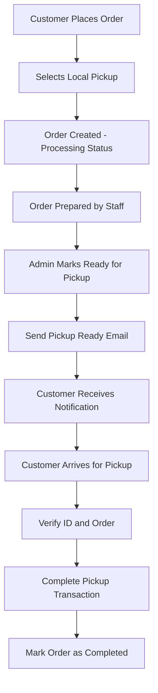

# Local Pickup Email Flow Documentation

## Overview

The Local Pickup Email System handles notifications for customers who choose to pick up their orders at the physical location. It provides clear pickup instructions, location details, and order information to ensure a smooth pickup experience.

## System Architecture

The local pickup email system sends confirmation emails when orders are ready for pickup, providing all necessary information for customers to collect their orders.

### Files Structure

```
app/api/emails/local-pickup/
└── route.js                        # Local pickup notification API endpoint

components/emails/
└── LocalPickupEmail.jsx             # Local pickup email template
```

## Email Type & Flow

### Local Pickup Ready Email

**Triggered**: When order is prepared and ready for pickup
**Purpose**: Notify customer that order is ready for collection
**Visual Theme**: Blue/Brand colors (informational)
**Key Information**: Pickup location, order details, required items to bring

## API Usage

### Endpoint

```
POST /api/emails/local-pickup
GET /api/emails/local-pickup (for preview)
```

### Request Structure

```javascript
{
  "orderData": {
    "code": "ORD-12345",
    "customer_name": "John Doe",
    "total": 89.99,
    "order_status": "ready_for_pickup",
    "payment_status": "paid",
    "products": [...],
    "ws_products": [...],
    "sub_total": 79.99,
    "tax_amount": 8.00,
    "discount_amount": 2.00,
    "pickup_details": {
      "first_name": "John",
      "last_name": "Doe",
      "email": "john@example.com",
      "phone": "+1234567890"
    },
    "created_at": "2024-01-15T10:00:00Z"
  },
  "recipientEmail": "john@example.com",
  "recipientName": "John Doe"
}
```

### Response Structure

```javascript
// Success
{
  "success": true,
  "message": "Local pickup email sent successfully",
  "emailId": "resend_email_id"
}

// Error
{
  "error": "Order data and recipient email are required",
  "status": 400
}
```

## Implementation Examples

### Basic Local Pickup Notification

```javascript
const sendLocalPickupEmail = async (orderData, customerEmail) => {
  try {
    const response = await fetch('/api/emails/local-pickup', {
      method: 'POST',
      headers: { 'Content-Type': 'application/json' },
      body: JSON.stringify({
        orderData: {
          ...orderData,
          order_status: 'ready_for_pickup',
        },
        recipientEmail: customerEmail,
        recipientName: orderData.customer_name,
      }),
    });

    const result = await response.json();

    if (result.success) {
      console.log('Local pickup email sent successfully:', result.emailId);
      return { success: true, emailId: result.emailId };
    } else {
      console.error('Failed to send local pickup email:', result.error);
      return { success: false, error: result.error };
    }
  } catch (error) {
    console.error('Error sending local pickup email:', error);
    return { success: false, error: error.message };
  }
};
```

### Order Processing Integration

```javascript
// In your order processing system
class OrderProcessor {
  async markOrderReadyForPickup(orderId) {
    try {
      // 1. Update order status
      const order = await this.updateOrderStatus(orderId, 'ready_for_pickup');

      // 2. Send pickup notification email
      const emailResult = await this.sendLocalPickupNotification(order);

      if (!emailResult.success) {
        console.error('Failed to send pickup notification:', emailResult.error);
        // Continue processing but log the error
      }

      // 3. Update inventory if needed
      await this.updateInventoryForPickup(order);

      // 4. Log the status change
      await this.logOrderStatusChange(orderId, 'ready_for_pickup', 'system');

      return {
        success: true,
        message: 'Order marked ready for pickup and customer notified',
        orderId: orderId,
      };
    } catch (error) {
      console.error('Error marking order ready for pickup:', error);
      return {
        success: false,
        error: error.message,
      };
    }
  }

  async sendLocalPickupNotification(order) {
    return await fetch('/api/emails/local-pickup', {
      method: 'POST',
      headers: { 'Content-Type': 'application/json' },
      body: JSON.stringify({
        orderData: order,
        recipientEmail: order.pickup_details?.email || order.customer_email,
        recipientName: order.customer_name,
      }),
    }).then((res) => res.json());
  }
}
```

### Admin Dashboard Integration

```javascript
// Admin interface for marking orders ready for pickup
const PickupManagement = () => {
  const [orders, setOrders] = useState([]);
  const [loading, setLoading] = useState(false);

  const markReadyForPickup = async (orderId) => {
    setLoading(true);
    try {
      const response = await fetch(`/api/orders/${orderId}/ready-for-pickup`, {
        method: 'POST',
      });

      const result = await response.json();

      if (result.success) {
        // Update local state
        setOrders((prevOrders) =>
          prevOrders.map((order) => (order.id === orderId ? { ...order, status: 'ready_for_pickup' } : order)),
        );

        alert('Order marked ready for pickup and customer notified!');
      } else {
        alert('Failed to mark order ready: ' + result.error);
      }
    } catch (error) {
      alert('Error: ' + error.message);
    } finally {
      setLoading(false);
    }
  };

  return (
    <div className="pickup-management">
      <h2>Orders Pending Pickup Preparation</h2>
      {orders
        .filter((order) => order.type === 'local_pickup' && order.status === 'processing')
        .map((order) => (
          <div key={order.id} className="order-card">
            <div className="order-info">
              <h3>Order #{order.code}</h3>
              <p>Customer: {order.customer_name}</p>
              <p>Items: {order.products.length + order.ws_products.length}</p>
              <p>Total: ${order.total}</p>
            </div>
            <button onClick={() => markReadyForPickup(order.id)} disabled={loading} className="ready-button">
              {loading ? 'Processing...' : 'Mark Ready for Pickup'}
            </button>
          </div>
        ))}
    </div>
  );
};
```

## Email Template Features

### Pickup Information Display

- **Prominent Location**: Clear display of pickup address
- **Operating Hours**: Store hours and availability
- **Contact Information**: Phone number and support details
- **Required Items**: What customers need to bring (ID, order confirmation)

### Order Details

- **Order Summary**: Complete list of products and quantities
- **Pricing Breakdown**: Subtotal, tax, discounts, and total
- **Order Status**: Clear indication that order is ready
- **Pickup Instructions**: Step-by-step pickup process

### Professional Design

- **Brand Consistency**: Loud Spectrum branding and colors
- **Clear Layout**: Easy-to-scan information hierarchy
- **Mobile Responsive**: Optimized for mobile email viewing
- **Accessibility**: Proper contrast and readable fonts

### Content Structure

1. **Header**: Branded logo and pickup ready notification
2. **Pickup Location**: Address with map-friendly formatting
3. **Important Information**: Required items and instructions
4. **Order Summary**: Complete order details and pricing
5. **Contact Section**: Support information for questions
6. **Footer**: Company information and branding

## Pickup Location Information

### Default Pickup Address

```
1907 N Main St
Santa Ana, CA 92706
```

### Pickup Instructions Included

- Bring valid photo ID
- Have order confirmation ready
- Confirmation email with pickup date and time will follow
- Contact support for any questions

## Integration Workflow

### Local Pickup Process Flow



### Staff Workflow Integration

```javascript
// Staff interface for pickup management
class PickupManager {
  async processPickupOrders() {
    // Get all orders ready to be prepared for pickup
    const pendingOrders = await this.getOrdersByStatus('processing', 'local_pickup');

    return pendingOrders.map((order) => ({
      id: order.id,
      code: order.code,
      customer: order.customer_name,
      items: this.formatOrderItems(order),
      total: order.total,
      created: order.created_at,
      actions: {
        markReady: () => this.markReadyForPickup(order.id),
        viewDetails: () => this.showOrderDetails(order.id),
      },
    }));
  }

  async markReadyForPickup(orderId) {
    try {
      // Update order status
      await this.updateOrderStatus(orderId, 'ready_for_pickup');

      // Send notification email
      const order = await this.getOrderById(orderId);
      await this.sendPickupNotification(order);

      // Log action
      await this.logAction('order_ready_for_pickup', { orderId, staff: this.currentUser });

      return { success: true };
    } catch (error) {
      console.error('Error marking order ready:', error);
      return { success: false, error: error.message };
    }
  }
}
```

## Environment Variables

Required environment variables:

```env
# Resend Configuration
RESEND_API_KEY=your_resend_api_key
RESEND_FROM_EMAIL=noreply@loudspectrum.com

# Application URLs
NEXT_PUBLIC_BASE_URL_EMAIL=https://yourdomain.com

# Pickup Location (if configurable)
PICKUP_ADDRESS_LINE1=1907 N Main St
PICKUP_CITY=Santa Ana
PICKUP_STATE=CA
PICKUP_ZIP=92706
PICKUP_PHONE=+1-555-123-4567
```

## Error Handling

### API Error Responses

```javascript
// Missing required data
{
  "error": "Order data and recipient email are required",
  "status": 400
}

// Email sending failure
{
  "error": "Failed to send email",
  "details": "Specific error from email service",
  "status": 500
}

// Internal server error
{
  "error": "Internal server error",
  "details": "Error message",
  "status": 500
}
```

### Client-Side Error Handling

```javascript
const handlePickupNotification = async (orderData) => {
  try {
    const response = await fetch('/api/emails/local-pickup', {
      method: 'POST',
      headers: { 'Content-Type': 'application/json' },
      body: JSON.stringify({
        orderData,
        recipientEmail: orderData.customer_email,
        recipientName: orderData.customer_name,
      }),
    });

    if (!response.ok) {
      const errorData = await response.json();
      throw new Error(errorData.error || 'Failed to send pickup notification');
    }

    const result = await response.json();
    return result;
  } catch (error) {
    console.error('Pickup notification error:', error);
    throw error;
  }
};
```

## Testing

### Manual Testing

```bash
# Test local pickup email
curl -X POST http://localhost:3000/api/emails/local-pickup \
  -H "Content-Type: application/json" \
  -d '{
    "orderData": {
      "code": "ORD-TEST-001",
      "customer_name": "Test Customer",
      "total": 45.99,
      "order_status": "ready_for_pickup",
      "products": [
        {
          "product": {
            "name": "Test Product",
            "sku": "TEST-001"
          },
          "quantity": 1,
          "selectedVolume": 15,
          "total": 45.99
        }
      ],
      "sub_total": 40.99,
      "tax_amount": 5.00,
      "created_at": "2024-01-15T10:00:00Z"
    },
    "recipientEmail": "test@example.com",
    "recipientName": "Test Customer"
  }'

# Preview email template
curl -X GET http://localhost:3000/api/emails/local-pickup
```

### Automated Testing

```javascript
// Jest test example
describe('Local Pickup Email', () => {
  test('should send pickup notification successfully', async () => {
    const orderData = {
      code: 'ORD-TEST-123',
      customer_name: 'John Doe',
      total: 89.99,
      order_status: 'ready_for_pickup',
      products: [
        {
          product: { name: 'Test Product', sku: 'TEST-001' },
          quantity: 2,
          selectedVolume: 10,
          total: 89.99,
        },
      ],
      sub_total: 79.99,
      tax_amount: 10.0,
      created_at: new Date().toISOString(),
    };

    const response = await request(app)
      .post('/api/emails/local-pickup')
      .send({
        orderData,
        recipientEmail: 'test@example.com',
        recipientName: 'John Doe',
      })
      .expect(200);

    expect(response.body.success).toBe(true);
    expect(response.body.emailId).toBeDefined();
  });

  test('should fail with missing order data', async () => {
    const response = await request(app)
      .post('/api/emails/local-pickup')
      .send({
        recipientEmail: 'test@example.com',
      })
      .expect(400);

    expect(response.body.error).toContain('Order data and recipient email are required');
  });
});
```

## Monitoring & Analytics

### Key Metrics to Track

- **Pickup Notification Rate**: Emails sent vs orders ready
- **Email Open Rate**: How many customers open pickup notifications
- **Pickup Completion Time**: Time from notification to actual pickup
- **No-Show Rate**: Orders not picked up after notification
- **Customer Satisfaction**: Feedback on pickup experience

### Logging Implementation

```javascript
const logPickupNotification = (orderData, success, error = null) => {
  const logData = {
    event: 'local_pickup_notification',
    order_id: orderData.code,
    customer_email: hashEmail(orderData.customer_email),
    order_total: orderData.total,
    success,
    timestamp: new Date().toISOString(),
    error: error?.message || null,
  };

  console.log(JSON.stringify(logData));

  // Send to analytics service
  analytics.track('Local Pickup Email Sent', {
    order_value: orderData.total,
    product_count: (orderData.products?.length || 0) + (orderData.ws_products?.length || 0),
    success,
  });
};
```

## Best Practices

### Customer Experience

1. **Clear Instructions**: Detailed pickup process and requirements
2. **Timely Notifications**: Send emails as soon as orders are ready
3. **Complete Information**: Include all necessary pickup details
4. **Professional Presentation**: Maintain brand consistency and quality
5. **Support Access**: Easy way to contact support for questions

### Operational Efficiency

1. **Staff Training**: Ensure staff know how to mark orders ready
2. **Inventory Management**: Update stock levels when orders are prepared
3. **Pickup Tracking**: Monitor pickup completion rates
4. **Customer Communication**: Proactive communication about delays
5. **Process Documentation**: Clear procedures for staff to follow

### Technical Implementation

1. **Error Handling**: Graceful handling of email sending failures
2. **Data Validation**: Verify order data before sending emails
3. **Performance**: Efficient email template rendering
4. **Monitoring**: Track email delivery and engagement
5. **Security**: Protect customer information in transit

### Pickup Location Management

1. **Address Accuracy**: Ensure pickup address is always current
2. **Operating Hours**: Keep store hours updated in communications
3. **Contact Information**: Maintain current phone numbers and support details
4. **Accessibility**: Consider accessibility needs for pickup location
5. **Parking Information**: Include parking details if relevant

This local pickup email system provides a professional, informative notification system that enhances the customer experience while supporting efficient store operations for order fulfillment.
