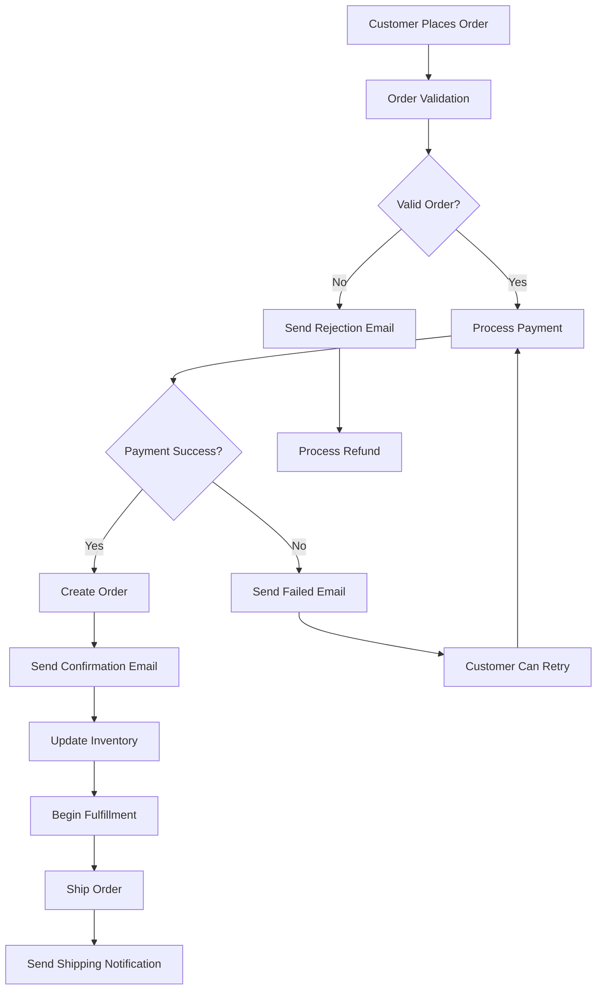
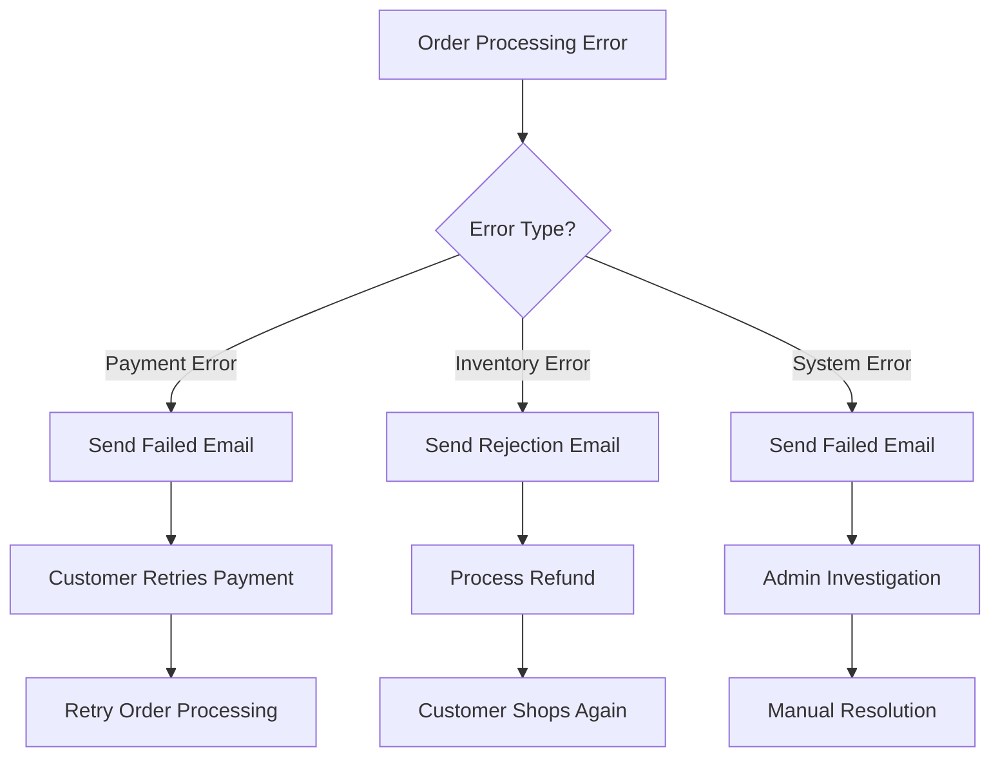

# Order Email Flow Documentation

## Overview

The Order Email System manages the complete lifecycle of order-related communications, from successful order confirmation to failed orders and order rejections. It provides comprehensive order information, tracking details, and clear next steps for customers throughout their order journey.

## System Architecture

The order email system consists of three main email types that cover different order scenarios, each with specialized templates and messaging.

### Files Structure

```
app/api/emails/order/
├── confirmation/
│   └── route.js                    # Order confirmation email API
├── failed/
│   └── route.js                    # Order failure notification API
└── rejection/
    └── route.js                    # Order rejection notification API

components/emails/
├── OrderConfirmationEmail.jsx      # Order confirmation email template
├── OrderFailedEmail.jsx            # Order failure email template
└── OrderRejectionEmail.jsx         # Order rejection email template
```

## Email Types & Flow

### 1. Order Confirmation Email (`confirmation`)

**Triggered**: When order is successfully placed and payment is confirmed
**Purpose**: Confirm order details and set customer expectations
**Visual Theme**: Green (success)
**Key Features**: Complete order summary, shipping details, tracking information

### 2. Order Failed Email (`failed`)

**Triggered**: When order processing fails due to system errors
**Purpose**: Notify customer of failure and provide next steps
**Visual Theme**: Red (error)
**Key Features**: Error explanation, retry options, support contact

### 3. Order Rejection Email (`rejection`)

**Triggered**: When order is manually rejected by admin/system
**Purpose**: Explain rejection reason and offer alternatives
**Visual Theme**: Orange/Yellow (warning)
**Key Features**: Rejection reason, refund information, alternative actions

## API Usage

### Endpoints

```
POST /api/emails/order/confirmation
POST /api/emails/order/failed
POST /api/emails/order/rejection

GET /api/emails/order/confirmation (for preview)
GET /api/emails/order/failed (for preview)
GET /api/emails/order/rejection (for preview)
```

### Request Structure

#### Order Confirmation

```javascript
{
  "orderData": {
    "_id": "507f1f77bcf86cd799439011",
    "code": "ORD-12345",
    "customer_name": "John Doe",
    "products": [...],
    "ws_products": [...],
    "sub_total": 129.98,
    "tax_amount": 10.4,
    "shipping_amount": 15.0,
    "discount_amount": 5.0,
    "total": 150.38,
    "payment_type": "CARD",
    "payment_status": "paid",
    "order_status": "processing",
    "type": "regular",
    "shipping_details": {...},
    "billing_details": {...},
    "created_at": "2024-01-15T10:00:00Z"
  },
  "recipientEmail": "john@example.com",
  "recipientName": "John Doe"
}
```

#### Order Failed

```javascript
{
  "orderData": {
    "code": "ORD-12345",
    "customer_name": "John Doe",
    "total": 150.38,
    "failure_reason": "Payment processing error",
    "error_details": "Card was declined",
    "retry_available": true,
    "support_ticket_id": "TKT-789",
    "created_at": "2024-01-15T10:00:00Z"
  },
  "recipientEmail": "john@example.com",
  "recipientName": "John Doe"
}
```

#### Order Rejection

```javascript
{
  "orderData": {
    "code": "ORD-12345",
    "customer_name": "John Doe",
    "total": 150.38,
    "rejection_reason": "Item out of stock",
    "rejection_details": "Selected product is temporarily unavailable",
    "refund_amount": 150.38,
    "refund_method": "Original payment method",
    "estimated_refund_time": "3-5 business days",
    "alternative_products": [...],
    "created_at": "2024-01-15T10:00:00Z"
  },
  "recipientEmail": "john@example.com",
  "recipientName": "John Doe"
}
```

## Implementation Examples

### Order Confirmation Flow

```javascript
const sendOrderConfirmation = async (orderData, customerEmail) => {
  try {
    const response = await fetch('/api/emails/order/confirmation', {
      method: 'POST',
      headers: { 'Content-Type': 'application/json' },
      body: JSON.stringify({
        orderData: {
          ...orderData,
          order_status: 'processing',
          payment_status: 'paid',
        },
        recipientEmail: customerEmail,
        recipientName: orderData.customer_name,
      }),
    });

    const result = await response.json();

    if (result.success) {
      console.log('Order confirmation sent:', result.emailId);
      return { success: true, emailId: result.emailId };
    } else {
      console.error('Failed to send order confirmation:', result.error);
      return { success: false, error: result.error };
    }
  } catch (error) {
    console.error('Error sending order confirmation:', error);
    return { success: false, error: error.message };
  }
};
```

### Complete Order Processing Integration

```javascript
class OrderProcessor {
  async processOrder(orderData) {
    try {
      // 1. Validate order data
      const validation = await this.validateOrder(orderData);
      if (!validation.success) {
        await this.sendOrderRejection(orderData, validation.reason);
        return { success: false, reason: validation.reason };
      }

      // 2. Process payment
      const paymentResult = await this.processPayment(orderData);
      if (!paymentResult.success) {
        await this.sendOrderFailed(orderData, paymentResult.error);
        return { success: false, reason: 'Payment failed' };
      }

      // 3. Create order in database
      const order = await this.createOrder({
        ...orderData,
        payment_status: 'paid',
        order_status: 'processing',
      });

      // 4. Send confirmation email
      await this.sendOrderConfirmation(order);

      // 5. Update inventory
      await this.updateInventory(order);

      return { success: true, orderId: order.id };
    } catch (error) {
      console.error('Order processing error:', error);
      await this.sendOrderFailed(orderData, error.message);
      return { success: false, reason: 'System error' };
    }
  }

  async sendOrderConfirmation(orderData) {
    return await fetch('/api/emails/order/confirmation', {
      method: 'POST',
      headers: { 'Content-Type': 'application/json' },
      body: JSON.stringify({
        orderData,
        recipientEmail: orderData.customer_email,
        recipientName: orderData.customer_name,
      }),
    }).then((res) => res.json());
  }

  async sendOrderFailed(orderData, errorMessage) {
    return await fetch('/api/emails/order/failed', {
      method: 'POST',
      headers: { 'Content-Type': 'application/json' },
      body: JSON.stringify({
        orderData: {
          ...orderData,
          failure_reason: 'Order processing failed',
          error_details: errorMessage,
          retry_available: true,
        },
        recipientEmail: orderData.customer_email,
        recipientName: orderData.customer_name,
      }),
    }).then((res) => res.json());
  }

  async sendOrderRejection(orderData, rejectionReason) {
    return await fetch('/api/emails/order/rejection', {
      method: 'POST',
      headers: { 'Content-Type': 'application/json' },
      body: JSON.stringify({
        orderData: {
          ...orderData,
          rejection_reason: rejectionReason,
          refund_amount: orderData.total,
          refund_method: 'Original payment method',
          estimated_refund_time: '3-5 business days',
        },
        recipientEmail: orderData.customer_email,
        recipientName: orderData.customer_name,
      }),
    }).then((res) => res.json());
  }
}
```

### Admin Order Management

```javascript
// Admin interface for order management
const OrderManagement = () => {
  const [orders, setOrders] = useState([]);
  const [loading, setLoading] = useState(false);

  const rejectOrder = async (orderId, reason) => {
    setLoading(true);
    try {
      const response = await fetch(`/api/orders/${orderId}/reject`, {
        method: 'POST',
        headers: { 'Content-Type': 'application/json' },
        body: JSON.stringify({ reason }),
      });

      const result = await response.json();

      if (result.success) {
        // Update local state
        setOrders((prevOrders) =>
          prevOrders.map((order) => (order.id === orderId ? { ...order, status: 'rejected' } : order)),
        );

        alert('Order rejected and customer notified');
      } else {
        alert('Failed to reject order: ' + result.error);
      }
    } catch (error) {
      alert('Error: ' + error.message);
    } finally {
      setLoading(false);
    }
  };

  const retryFailedOrder = async (orderId) => {
    setLoading(true);
    try {
      const response = await fetch(`/api/orders/${orderId}/retry`, {
        method: 'POST',
      });

      const result = await response.json();

      if (result.success) {
        setOrders((prevOrders) =>
          prevOrders.map((order) => (order.id === orderId ? { ...order, status: 'processing' } : order)),
        );

        alert('Order retry initiated');
      } else {
        alert('Failed to retry order: ' + result.error);
      }
    } catch (error) {
      alert('Error: ' + error.message);
    } finally {
      setLoading(false);
    }
  };

  return (
    <div className="order-management">
      <h2>Order Management</h2>
      {orders.map((order) => (
        <div key={order.id} className={`order-card status-${order.status}`}>
          <div className="order-info">
            <h3>Order #{order.code}</h3>
            <p>Customer: {order.customer_name}</p>
            <p>Total: ${order.total}</p>
            <p>Status: {order.status}</p>
          </div>
          <div className="order-actions">
            {order.status === 'pending' && (
              <>
                <button onClick={() => confirmOrder(order.id)}>Confirm Order</button>
                <button onClick={() => rejectOrder(order.id, 'Manual review required')}>Reject Order</button>
              </>
            )}
            {order.status === 'failed' && <button onClick={() => retryFailedOrder(order.id)}>Retry Order</button>}
          </div>
        </div>
      ))}
    </div>
  );
};
```

## Email Template Features

### Order Confirmation Email Features

- **Complete Order Summary**: Detailed product list with quantities and pricing
- **Payment Information**: Payment method and transaction details
- **Shipping Details**: Delivery address and estimated timeline
- **Tracking Information**: Order tracking number and status updates
- **Customer Support**: Easy access to help and order modifications
- **Next Steps**: Clear expectations for order fulfillment

### Order Failed Email Features

- **Error Explanation**: Clear description of what went wrong
- **Retry Options**: Simple ways to reprocess the order
- **Support Contact**: Direct access to customer service
- **Alternative Actions**: Suggestions for resolving the issue
- **Reassurance**: Professional handling of the situation

### Order Rejection Email Features

- **Rejection Reason**: Clear explanation of why order was rejected
- **Refund Information**: Details about refund process and timeline
- **Alternative Products**: Suggestions for similar available items
- **Support Access**: Easy way to discuss alternatives
- **Professional Tone**: Maintaining positive customer relationship

## Integration Workflow

### Order Processing Flow



### Error Handling Flow



## Environment Variables

Required environment variables:

```env
# Resend Configuration
RESEND_API_KEY=your_resend_api_key
RESEND_FROM_EMAIL=noreply@loudspectrum.com

# Application URLs
NEXT_PUBLIC_BASE_URL_EMAIL=https://yourdomain.com

# Order Configuration
ORDER_CONFIRMATION_CC=orders@loudspectrum.com
ORDER_FAILURE_ALERT_EMAIL=admin@loudspectrum.com
ORDER_REJECTION_CC=support@loudspectrum.com

# Development Settings
NODE_ENV=production|development
DEV_EMAIL_OVERRIDE=dev@loudspectrum.com
```

## Error Handling

### API Error Responses

```javascript
// Missing required data
{
  "error": "Order data and recipient email are required",
  "status": 400
}

// Email sending failure
{
  "error": "Failed to send email",
  "details": "Specific error from email service",
  "status": 500
}

// Invalid order data
{
  "error": "Invalid order data",
  "details": "Missing required fields: customer_name, total",
  "status": 400
}
```

### Comprehensive Error Handling

```javascript
const handleOrderEmail = async (emailType, orderData, recipientEmail) => {
  try {
    // Validate input data
    if (!orderData || !recipientEmail) {
      throw new Error('Missing required order data or recipient email');
    }

    // Validate order data structure
    const requiredFields = ['code', 'customer_name', 'total'];
    const missingFields = requiredFields.filter((field) => !orderData[field]);

    if (missingFields.length > 0) {
      throw new Error(`Missing required fields: ${missingFields.join(', ')}`);
    }

    // Send email
    const response = await fetch(`/api/emails/order/${emailType}`, {
      method: 'POST',
      headers: { 'Content-Type': 'application/json' },
      body: JSON.stringify({
        orderData,
        recipientEmail,
        recipientName: orderData.customer_name,
      }),
    });

    if (!response.ok) {
      const errorData = await response.json();
      throw new Error(errorData.error || `Failed to send ${emailType} email`);
    }

    const result = await response.json();
    return result;
  } catch (error) {
    console.error(`Order ${emailType} email error:`, error);

    // Log error for monitoring
    logOrderEmailError(emailType, orderData?.code, error);

    throw error;
  }
};
```

## Testing

### Manual Testing

```bash
# Test order confirmation email
curl -X POST http://localhost:3000/api/emails/order/confirmation \
  -H "Content-Type: application/json" \
  -d '{
    "orderData": {
      "code": "ORD-TEST-001",
      "customer_name": "Test Customer",
      "total": 150.38,
      "order_status": "processing",
      "payment_status": "paid",
      "products": [
        {
          "product": {"name": "Test Product", "sku": "TEST-001"},
          "quantity": 2,
          "total": 150.38
        }
      ],
      "created_at": "2024-01-15T10:00:00Z"
    },
    "recipientEmail": "test@example.com",
    "recipientName": "Test Customer"
  }'

# Preview email templates
curl -X GET http://localhost:3000/api/emails/order/confirmation
curl -X GET http://localhost:3000/api/emails/order/failed
curl -X GET http://localhost:3000/api/emails/order/rejection
```

### Automated Testing

```javascript
// Jest test suite for order emails
describe('Order Email System', () => {
  describe('Order Confirmation', () => {
    test('should send confirmation email successfully', async () => {
      const orderData = {
        code: 'ORD-TEST-123',
        customer_name: 'John Doe',
        total: 89.99,
        order_status: 'processing',
        payment_status: 'paid',
        products: [
          {
            product: { name: 'Test Product', sku: 'TEST-001' },
            quantity: 1,
            total: 89.99,
          },
        ],
        created_at: new Date().toISOString(),
      };

      const response = await request(app)
        .post('/api/emails/order/confirmation')
        .send({
          orderData,
          recipientEmail: 'test@example.com',
          recipientName: 'John Doe',
        })
        .expect(200);

      expect(response.body.success).toBe(true);
      expect(response.body.emailId).toBeDefined();
    });
  });

  describe('Order Failed', () => {
    test('should send failure notification', async () => {
      const orderData = {
        code: 'ORD-FAILED-123',
        customer_name: 'Jane Doe',
        total: 75.5,
        failure_reason: 'Payment declined',
        retry_available: true,
      };

      const response = await request(app)
        .post('/api/emails/order/failed')
        .send({
          orderData,
          recipientEmail: 'jane@example.com',
          recipientName: 'Jane Doe',
        })
        .expect(200);

      expect(response.body.success).toBe(true);
    });
  });

  describe('Order Rejection', () => {
    test('should send rejection notification', async () => {
      const orderData = {
        code: 'ORD-REJECTED-123',
        customer_name: 'Bob Smith',
        total: 120.0,
        rejection_reason: 'Item out of stock',
        refund_amount: 120.0,
      };

      const response = await request(app)
        .post('/api/emails/order/rejection')
        .send({
          orderData,
          recipientEmail: 'bob@example.com',
          recipientName: 'Bob Smith',
        })
        .expect(200);

      expect(response.body.success).toBe(true);
    });
  });
});
```

## Monitoring & Analytics

### Key Metrics to Track

- **Email Delivery Rate**: Successful email sends vs attempts
- **Open Rates**: Customer engagement with order emails
- **Order Completion Rate**: Confirmed orders vs total attempts
- **Failure Recovery Rate**: Failed orders that are successfully retried
- **Customer Support Contacts**: Emails that lead to support requests

### Comprehensive Logging

```javascript
const logOrderEmail = (emailType, orderData, success, error = null) => {
  const logData = {
    event: `order_email_${emailType}`,
    order_id: orderData.code,
    customer_email: hashEmail(orderData.customer_email),
    order_total: orderData.total,
    order_status: orderData.order_status,
    payment_status: orderData.payment_status,
    success,
    timestamp: new Date().toISOString(),
    error: error?.message || null,
  };

  console.log(JSON.stringify(logData));

  // Send to analytics service
  analytics.track(`Order Email ${emailType}`, {
    order_value: orderData.total,
    success,
    error_type: error?.name || null,
  });
};
```

## Best Practices

### Customer Communication

1. **Timely Notifications**: Send emails immediately after order status changes
2. **Clear Information**: Provide complete order details and next steps
3. **Professional Tone**: Maintain brand voice across all order communications
4. **Support Access**: Make it easy for customers to get help
5. **Expectation Setting**: Clearly communicate timelines and processes

### Order Management

1. **Status Tracking**: Maintain accurate order status throughout lifecycle
2. **Error Recovery**: Provide clear paths for resolving order issues
3. **Inventory Integration**: Keep order emails synchronized with inventory
4. **Payment Integration**: Ensure payment status is accurately reflected
5. **Shipping Coordination**: Coordinate order emails with fulfillment systems

### Technical Implementation

1. **Data Validation**: Thoroughly validate all order data before sending emails
2. **Error Handling**: Gracefully handle and log all email sending errors
3. **Performance**: Optimize email template rendering for speed
4. **Scalability**: Design system to handle high order volumes
5. **Monitoring**: Implement comprehensive logging and alerting

This order email system provides comprehensive communication throughout the entire order lifecycle, ensuring customers are always informed about their order status while providing clear paths for resolution when issues arise.
