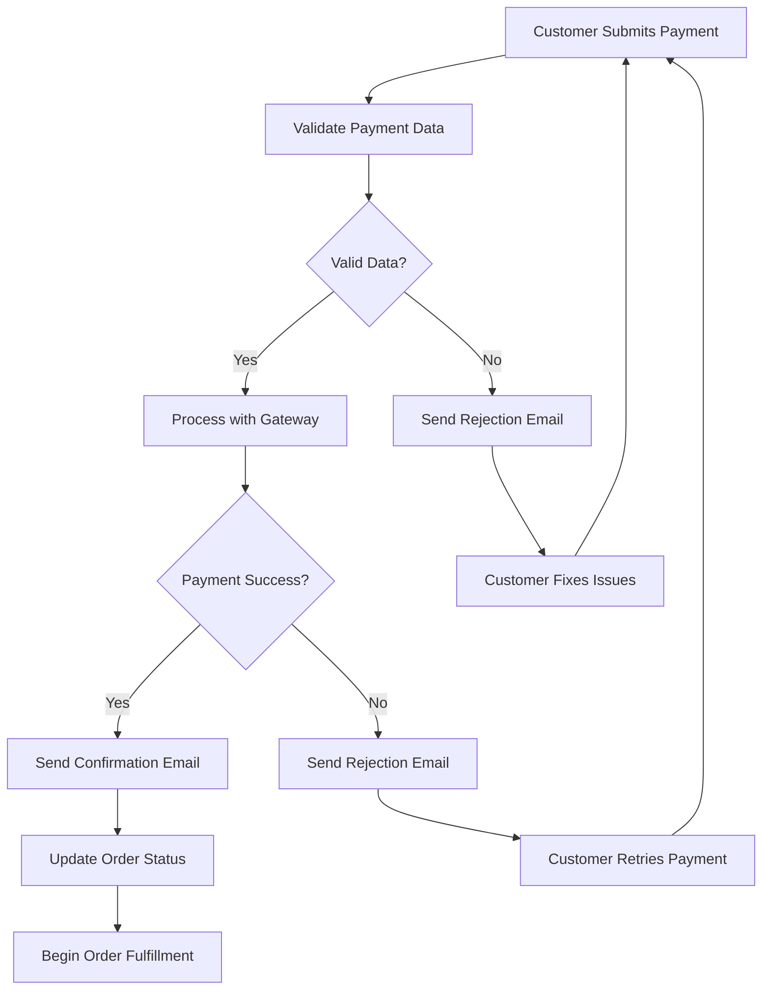
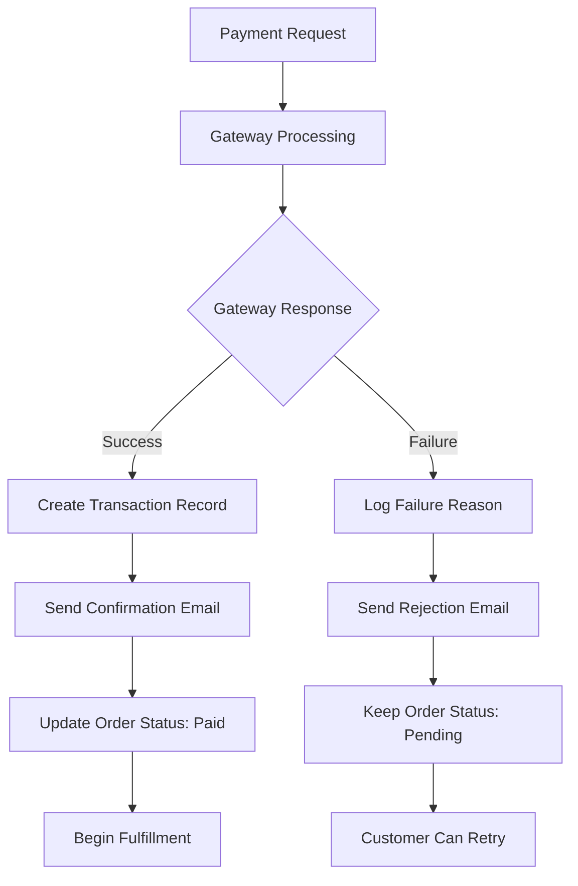

# Payment Email Flow Documentation

## Overview

The Payment Email System handles all payment-related communications, including successful payment confirmations and payment rejection notifications. It provides clear transaction details, receipt information, and guidance for resolving payment issues.

## System Architecture

The payment email system consists of two main email types that handle different payment scenarios with specialized templates and messaging appropriate for each situation.

### Files Structure

```
app/api/emails/payment/
├── confirmation/
│   └── route.js                    # Payment confirmation email API
└── rejection/
    └── route.js                    # Payment rejection email API

components/emails/
├── PaymentConfirmationEmail.jsx    # Payment confirmation email template
└── PaymentRejectionEmail.jsx       # Payment rejection email template
```

## Email Types & Flow

### 1. Payment Confirmation Email (`confirmation`)

**Triggered**: When payment is successfully processed
**Purpose**: Confirm payment and provide transaction receipt
**Visual Theme**: Green (success)
**Key Features**: Transaction details, receipt information, order confirmation

### 2. Payment Rejection Email (`rejection`)

**Triggered**: When payment is declined or fails
**Purpose**: Notify customer of payment failure and provide resolution options
**Visual Theme**: Red (error/action required)
**Key Features**: Failure reason, retry options, alternative payment methods

## API Usage

### Endpoints

```
POST /api/emails/payment/confirmation
POST /api/emails/payment/rejection

GET /api/emails/payment/confirmation (for preview)
GET /api/emails/payment/rejection (for preview)
```

### Request Structure

#### Payment Confirmation

```javascript
{
  "paymentData": {
    "transaction_id": "TXN-789123456",
    "order_code": "ORD-12345",
    "customer_name": "John Doe",
    "amount": 150.38,
    "currency": "USD",
    "payment_method": "Credit Card",
    "card_last_four": "4242",
    "card_brand": "Visa",
    "billing_address": {
      "street": "123 Main St",
      "city": "New York",
      "state": "NY",
      "zip": "10001",
      "country": "United States"
    },
    "transaction_date": "2024-01-15T10:00:00Z",
    "status": "completed",
    "receipt_url": "https://example.com/receipt/TXN-789123456"
  },
  "recipientEmail": "john@example.com",
  "recipientName": "John Doe"
}
```

#### Payment Rejection

```javascript
{
  "paymentData": {
    "transaction_id": "TXN-FAILED-123",
    "order_code": "ORD-12345",
    "customer_name": "John Doe",
    "amount": 150.38,
    "currency": "USD",
    "payment_method": "Credit Card",
    "failure_reason": "Insufficient funds",
    "failure_code": "CARD_DECLINED",
    "decline_code": "insufficient_funds",
    "retry_available": true,
    "alternative_methods": ["PayPal", "Bank Transfer", "Different Card"],
    "transaction_date": "2024-01-15T10:00:00Z",
    "support_reference": "SUP-456789"
  },
  "recipientEmail": "john@example.com",
  "recipientName": "John Doe"
}
```

## Implementation Examples

### Payment Confirmation Flow

```javascript
const sendPaymentConfirmation = async (paymentData, customerEmail) => {
  try {
    const response = await fetch('/api/emails/payment/confirmation', {
      method: 'POST',
      headers: { 'Content-Type': 'application/json' },
      body: JSON.stringify({
        paymentData: {
          ...paymentData,
          status: 'completed',
        },
        recipientEmail: customerEmail,
        recipientName: paymentData.customer_name,
      }),
    });

    const result = await response.json();

    if (result.success) {
      console.log('Payment confirmation sent:', result.emailId);
      return { success: true, emailId: result.emailId };
    } else {
      console.error('Failed to send payment confirmation:', result.error);
      return { success: false, error: result.error };
    }
  } catch (error) {
    console.error('Error sending payment confirmation:', error);
    return { success: false, error: error.message };
  }
};
```

### Complete Payment Processing Integration

```javascript
class PaymentProcessor {
  async processPayment(paymentData) {
    try {
      // 1. Validate payment data
      const validation = await this.validatePayment(paymentData);
      if (!validation.success) {
        await this.sendPaymentRejection(paymentData, validation.reason);
        return { success: false, reason: validation.reason };
      }

      // 2. Process payment with payment gateway
      const paymentResult = await this.chargePayment(paymentData);

      if (paymentResult.success) {
        // 3. Send confirmation email
        await this.sendPaymentConfirmation({
          ...paymentData,
          transaction_id: paymentResult.transactionId,
          status: 'completed',
          receipt_url: paymentResult.receiptUrl,
        });

        // 4. Update order status
        await this.updateOrderPaymentStatus(paymentData.order_code, 'paid');

        return {
          success: true,
          transactionId: paymentResult.transactionId,
          receiptUrl: paymentResult.receiptUrl,
        };
      } else {
        // 5. Send rejection email
        await this.sendPaymentRejection(paymentData, paymentResult.error);
        return { success: false, reason: paymentResult.error };
      }
    } catch (error) {
      console.error('Payment processing error:', error);
      await this.sendPaymentRejection(paymentData, 'System error occurred');
      return { success: false, reason: 'System error' };
    }
  }

  async sendPaymentConfirmation(paymentData) {
    return await fetch('/api/emails/payment/confirmation', {
      method: 'POST',
      headers: { 'Content-Type': 'application/json' },
      body: JSON.stringify({
        paymentData,
        recipientEmail: paymentData.customer_email,
        recipientName: paymentData.customer_name,
      }),
    }).then((res) => res.json());
  }

  async sendPaymentRejection(paymentData, failureReason) {
    return await fetch('/api/emails/payment/rejection', {
      method: 'POST',
      headers: { 'Content-Type': 'application/json' },
      body: JSON.stringify({
        paymentData: {
          ...paymentData,
          failure_reason: failureReason,
          retry_available: this.isRetryable(failureReason),
          alternative_methods: this.getAlternativeMethods(),
        },
        recipientEmail: paymentData.customer_email,
        recipientName: paymentData.customer_name,
      }),
    }).then((res) => res.json());
  }

  isRetryable(failureReason) {
    const retryableReasons = ['insufficient_funds', 'card_declined', 'expired_card', 'incorrect_cvc'];
    return retryableReasons.includes(failureReason);
  }

  getAlternativeMethods() {
    return ['PayPal', 'Bank Transfer', 'Different Credit Card', 'Wire Transfer'];
  }
}
```

### Frontend Payment Integration

```javascript
// React payment form with email notifications
const PaymentForm = ({ orderData }) => {
  const [paymentData, setPaymentData] = useState({
    cardNumber: '',
    expiryDate: '',
    cvv: '',
    cardholderName: '',
  });
  const [processing, setProcessing] = useState(false);
  const [paymentStatus, setPaymentStatus] = useState(null);

  const handlePayment = async (e) => {
    e.preventDefault();
    setProcessing(true);

    try {
      // Process payment
      const paymentResult = await processPayment({
        ...paymentData,
        amount: orderData.total,
        order_code: orderData.code,
        customer_name: orderData.customer_name,
        customer_email: orderData.customer_email,
      });

      if (paymentResult.success) {
        setPaymentStatus('success');
        // Payment confirmation email is sent automatically by the processor
      } else {
        setPaymentStatus('failed');
        // Payment rejection email is sent automatically by the processor
      }
    } catch (error) {
      console.error('Payment error:', error);
      setPaymentStatus('error');
    } finally {
      setProcessing(false);
    }
  };

  if (paymentStatus === 'success') {
    return (
      <div className="payment-success">
        <h3>Payment Successful!</h3>
        <p>Your payment has been processed successfully.</p>
        <p>A confirmation email has been sent to {orderData.customer_email}</p>
        <button onClick={() => (window.location.href = '/orders')}>View Order</button>
      </div>
    );
  }

  if (paymentStatus === 'failed') {
    return (
      <div className="payment-failed">
        <h3>Payment Failed</h3>
        <p>We were unable to process your payment.</p>
        <p>Please check your email for details and retry options.</p>
        <button onClick={() => setPaymentStatus(null)}>Try Again</button>
      </div>
    );
  }

  return (
    <form onSubmit={handlePayment} className="payment-form">
      <div className="form-group">
        <label>Card Number</label>
        <input
          type="text"
          value={paymentData.cardNumber}
          onChange={(e) =>
            setPaymentData((prev) => ({
              ...prev,
              cardNumber: e.target.value,
            }))
          }
          placeholder="1234 5678 9012 3456"
          required
        />
      </div>

      <div className="form-row">
        <div className="form-group">
          <label>Expiry Date</label>
          <input
            type="text"
            value={paymentData.expiryDate}
            onChange={(e) =>
              setPaymentData((prev) => ({
                ...prev,
                expiryDate: e.target.value,
              }))
            }
            placeholder="MM/YY"
            required
          />
        </div>

        <div className="form-group">
          <label>CVV</label>
          <input
            type="text"
            value={paymentData.cvv}
            onChange={(e) =>
              setPaymentData((prev) => ({
                ...prev,
                cvv: e.target.value,
              }))
            }
            placeholder="123"
            required
          />
        </div>
      </div>

      <div className="form-group">
        <label>Cardholder Name</label>
        <input
          type="text"
          value={paymentData.cardholderName}
          onChange={(e) =>
            setPaymentData((prev) => ({
              ...prev,
              cardholderName: e.target.value,
            }))
          }
          placeholder="John Doe"
          required
        />
      </div>

      <button type="submit" disabled={processing}>
        {processing ? 'Processing Payment...' : `Pay $${orderData.total}`}
      </button>
    </form>
  );
};
```

## Email Template Features

### Payment Confirmation Email Features

- **Transaction Receipt**: Complete payment details and transaction ID
- **Payment Method**: Clear display of payment method used
- **Billing Information**: Billing address and card details (masked)
- **Order Reference**: Link between payment and order
- **Receipt Download**: Access to downloadable receipt
- **Support Information**: Contact details for payment questions

### Payment Rejection Email Features

- **Failure Explanation**: Clear reason why payment was declined
- **Retry Instructions**: Steps to retry payment with same or different method
- **Alternative Methods**: Suggestions for other payment options
- **Support Contact**: Direct access to payment support team
- **Security Information**: Reassurance about data security
- **Next Steps**: Clear guidance on how to proceed

### Common Design Features

- **Professional Branding**: Loud Spectrum brand consistency
- **Security Indicators**: Trust signals and security information
- **Clear Typography**: Easy-to-read transaction details
- **Mobile Responsive**: Optimized for mobile email viewing
- **Accessibility**: Proper contrast and screen reader compatibility

## Integration Workflow

### Payment Processing Flow



### Payment Gateway Integration



## Environment Variables

Required environment variables:

```env
# Resend Configuration
RESEND_API_KEY=your_resend_api_key
RESEND_FROM_EMAIL=noreply@loudspectrum.com

# Application URLs
NEXT_PUBLIC_BASE_URL_EMAIL=https://yourdomain.com

# Payment Configuration
PAYMENT_GATEWAY_WEBHOOK_SECRET=your_webhook_secret
RECEIPT_BASE_URL=https://yourdomain.com/receipts/
PAYMENT_SUPPORT_EMAIL=payments@loudspectrum.com

# Development Settings
NODE_ENV=production|development
DEV_EMAIL_OVERRIDE=dev@loudspectrum.com
```

## Error Handling

### API Error Responses

```javascript
// Missing required data
{
  "error": "Payment data and recipient email are required",
  "status": 400
}

// Invalid payment data
{
  "error": "Invalid payment data",
  "details": "Missing required fields: transaction_id, amount",
  "status": 400
}

// Email sending failure
{
  "error": "Failed to send email",
  "details": "Specific error from email service",
  "status": 500
}
```

### Comprehensive Error Handling

```javascript
const handlePaymentEmail = async (emailType, paymentData, recipientEmail) => {
  try {
    // Validate input data
    if (!paymentData || !recipientEmail) {
      throw new Error('Missing required payment data or recipient email');
    }

    // Validate payment data structure
    const requiredFields =
      emailType === 'confirmation'
        ? ['transaction_id', 'amount', 'customer_name']
        : ['order_code', 'amount', 'customer_name', 'failure_reason'];

    const missingFields = requiredFields.filter((field) => !paymentData[field]);

    if (missingFields.length > 0) {
      throw new Error(`Missing required fields: ${missingFields.join(', ')}`);
    }

    // Send email
    const response = await fetch(`/api/emails/payment/${emailType}`, {
      method: 'POST',
      headers: { 'Content-Type': 'application/json' },
      body: JSON.stringify({
        paymentData,
        recipientEmail,
        recipientName: paymentData.customer_name,
      }),
    });

    if (!response.ok) {
      const errorData = await response.json();
      throw new Error(errorData.error || `Failed to send ${emailType} email`);
    }

    const result = await response.json();
    return result;
  } catch (error) {
    console.error(`Payment ${emailType} email error:`, error);

    // Log error for monitoring
    logPaymentEmailError(emailType, paymentData?.transaction_id, error);

    throw error;
  }
};
```

## Security Considerations

### Payment Data Security

```javascript
// Mask sensitive payment information
const maskPaymentData = (paymentData) => {
  return {
    ...paymentData,
    card_number: paymentData.card_number ? `****-****-****-${paymentData.card_number.slice(-4)}` : null,
    cvv: undefined, // Never include CVV in emails
    full_card_number: undefined, // Never include full card number
  };
};

// Secure transaction logging
const logPaymentTransaction = (paymentData, success) => {
  const secureLogData = {
    transaction_id: paymentData.transaction_id,
    order_code: paymentData.order_code,
    amount: paymentData.amount,
    payment_method: paymentData.payment_method,
    card_last_four: paymentData.card_last_four,
    success,
    timestamp: new Date().toISOString(),
    // Never log: full card number, CVV, sensitive personal data
  };

  console.log(JSON.stringify(secureLogData));
};
```

### PCI Compliance Considerations

```javascript
// Ensure PCI compliance in email content
const sanitizePaymentDataForEmail = (paymentData) => {
  return {
    transaction_id: paymentData.transaction_id,
    amount: paymentData.amount,
    currency: paymentData.currency,
    payment_method: paymentData.payment_method,
    card_brand: paymentData.card_brand,
    card_last_four: paymentData.card_last_four, // Only last 4 digits
    transaction_date: paymentData.transaction_date,
    status: paymentData.status,
    // Exclude: full card number, CVV, PIN, magnetic stripe data
  };
};
```

## Testing

### Manual Testing

```bash
# Test payment confirmation email
curl -X POST http://localhost:3000/api/emails/payment/confirmation \
  -H "Content-Type: application/json" \
  -d '{
    "paymentData": {
      "transaction_id": "TXN-TEST-001",
      "order_code": "ORD-12345",
      "customer_name": "Test Customer",
      "amount": 150.38,
      "currency": "USD",
      "payment_method": "Credit Card",
      "card_last_four": "4242",
      "card_brand": "Visa",
      "transaction_date": "2024-01-15T10:00:00Z",
      "status": "completed"
    },
    "recipientEmail": "test@example.com",
    "recipientName": "Test Customer"
  }'

# Test payment rejection email
curl -X POST http://localhost:3000/api/emails/payment/rejection \
  -H "Content-Type: application/json" \
  -d '{
    "paymentData": {
      "transaction_id": "TXN-FAILED-001",
      "order_code": "ORD-12345",
      "customer_name": "Test Customer",
      "amount": 150.38,
      "failure_reason": "Card declined",
      "retry_available": true
    },
    "recipientEmail": "test@example.com",
    "recipientName": "Test Customer"
  }'
```

### Automated Testing

```javascript
// Jest test suite for payment emails
describe('Payment Email System', () => {
  describe('Payment Confirmation', () => {
    test('should send confirmation email successfully', async () => {
      const paymentData = {
        transaction_id: 'TXN-TEST-123',
        order_code: 'ORD-12345',
        customer_name: 'John Doe',
        amount: 89.99,
        currency: 'USD',
        payment_method: 'Credit Card',
        card_last_four: '4242',
        card_brand: 'Visa',
        status: 'completed',
        transaction_date: new Date().toISOString(),
      };

      const response = await request(app)
        .post('/api/emails/payment/confirmation')
        .send({
          paymentData,
          recipientEmail: 'test@example.com',
          recipientName: 'John Doe',
        })
        .expect(200);

      expect(response.body.success).toBe(true);
      expect(response.body.emailId).toBeDefined();
    });

    test('should not include sensitive data in email', async () => {
      const paymentData = {
        transaction_id: 'TXN-TEST-456',
        full_card_number: '4242424242424242', // This should be filtered out
        cvv: '123', // This should be filtered out
        amount: 89.99,
        customer_name: 'John Doe',
      };

      const response = await request(app)
        .post('/api/emails/payment/confirmation')
        .send({
          paymentData,
          recipientEmail: 'test@example.com',
          recipientName: 'John Doe',
        })
        .expect(200);

      // Verify sensitive data is not included in the email
      expect(response.body.success).toBe(true);
    });
  });

  describe('Payment Rejection', () => {
    test('should send rejection email with retry options', async () => {
      const paymentData = {
        transaction_id: 'TXN-FAILED-123',
        order_code: 'ORD-12345',
        customer_name: 'Jane Doe',
        amount: 75.5,
        failure_reason: 'Insufficient funds',
        retry_available: true,
        alternative_methods: ['PayPal', 'Bank Transfer'],
      };

      const response = await request(app)
        .post('/api/emails/payment/rejection')
        .send({
          paymentData,
          recipientEmail: 'jane@example.com',
          recipientName: 'Jane Doe',
        })
        .expect(200);

      expect(response.body.success).toBe(true);
    });
  });
});
```

## Monitoring & Analytics

### Key Metrics to Track

- **Payment Success Rate**: Successful payments vs total attempts
- **Email Delivery Rate**: Payment emails sent vs delivery confirmations
- **Customer Recovery Rate**: Failed payments that are successfully retried
- **Payment Method Performance**: Success rates by payment method
- **Support Contact Rate**: Payment emails that lead to support requests

### Comprehensive Logging

```javascript
const logPaymentEmail = (emailType, paymentData, success, error = null) => {
  const logData = {
    event: `payment_email_${emailType}`,
    transaction_id: paymentData.transaction_id,
    order_code: paymentData.order_code,
    amount: paymentData.amount,
    payment_method: paymentData.payment_method,
    success,
    timestamp: new Date().toISOString(),
    error: error?.message || null,
  };

  console.log(JSON.stringify(logData));

  // Send to analytics service
  analytics.track(`Payment Email ${emailType}`, {
    transaction_amount: paymentData.amount,
    payment_method: paymentData.payment_method,
    success,
    failure_reason: paymentData.failure_reason || null,
  });
};
```

## Best Practices

### Customer Experience

1. **Immediate Notifications**: Send payment emails immediately after processing
2. **Clear Transaction Details**: Provide complete payment information
3. **Security Reassurance**: Include security indicators and trust signals
4. **Easy Support Access**: Make it simple to contact payment support
5. **Professional Presentation**: Maintain consistent branding and quality

### Payment Security

1. **Data Minimization**: Only include necessary payment information in emails
2. **PCI Compliance**: Follow PCI DSS guidelines for payment data handling
3. **Secure Transmission**: Use encrypted email delivery when possible
4. **Audit Logging**: Maintain comprehensive logs for compliance
5. **Regular Security Reviews**: Periodically review email content for security

### Technical Implementation

1. **Data Validation**: Thoroughly validate payment data before sending emails
2. **Error Handling**: Gracefully handle all payment processing errors
3. **Performance**: Optimize email sending for high transaction volumes
4. **Monitoring**: Implement comprehensive payment email tracking
5. **Integration**: Ensure seamless integration with payment gateways

This payment email system provides secure, professional communication for all payment scenarios while maintaining PCI compliance and delivering excellent customer experience throughout the payment process.
