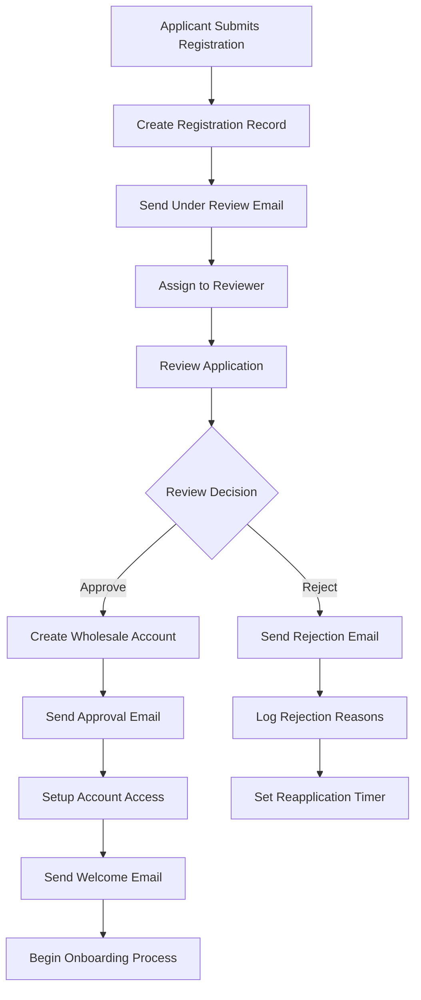
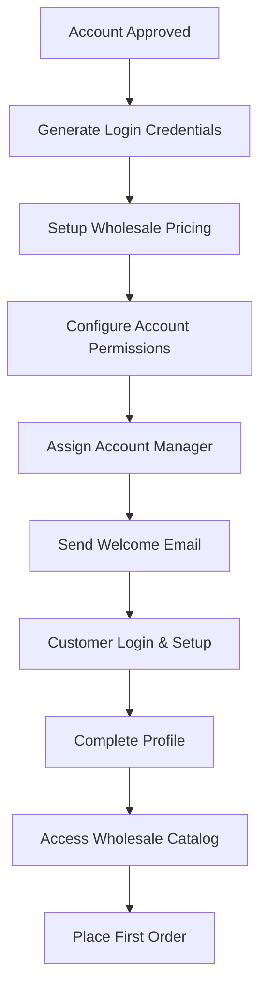

# Wholesale Registration Email Flow Documentation

## Overview

The Wholesale Registration Email System manages the complete lifecycle of wholesale partner applications, from initial submission to final approval or rejection. It provides comprehensive communication throughout the review process, keeping applicants informed of their status and next steps.

## System Architecture

The wholesale registration email system consists of four distinct email types that guide applicants through the entire registration and review process.

### Files Structure

```
app/api/emails/wholesale-registration/
├── review/
│   └── route.js                        # Under review notification API
├── approve/
│   └── route.js                        # Approval notification API
├── rejection/
│   └── route.js                        # Rejection notification API
└── welcome/
    └── route.js                        # Welcome/onboarding API

components/emails/
├── WholesaleRegistrationUnderReviewEmail.jsx    # Under review email template
├── WholesaleRegistrationApproveEmail.jsx        # Approval email template
├── WholesaleRegistrationRejectionEmail.jsx      # Rejection email template
└── WholesaleRegistrationWelcomeEmail.jsx        # Welcome email template
```

## Email Types & Flow

### 1. Under Review Email (`review`)

**Triggered**: When wholesale registration is submitted and review begins
**Purpose**: Acknowledge receipt and set expectations for review process
**Visual Theme**: Yellow/Orange (pending status)
**Key Features**: Review timeline, required documents, reviewer contact

### 2. Approval Email (`approve`)

**Triggered**: When wholesale registration is approved
**Purpose**: Welcome new wholesale partner and provide access details
**Visual Theme**: Green (success)
**Key Features**: Account activation, pricing information, next steps

### 3. Rejection Email (`rejection`)

**Triggered**: When wholesale registration is rejected
**Purpose**: Explain rejection reason and provide guidance for reapplication
**Visual Theme**: Red (rejection)
**Key Features**: Rejection reasons, improvement suggestions, reapplication process

### 4. Welcome Email (`welcome`)

**Triggered**: After account setup is complete for approved partners
**Purpose**: Comprehensive onboarding and resource access
**Visual Theme**: Blue/Brand (informational)
**Key Features**: Account details, resources, support contacts

## API Usage

### Endpoints

```
POST /api/emails/wholesale-registration/review
POST /api/emails/wholesale-registration/approve
POST /api/emails/wholesale-registration/rejection
POST /api/emails/wholesale-registration/welcome

GET /api/emails/wholesale-registration/review?preview=true
GET /api/emails/wholesale-registration/approve?preview=true
GET /api/emails/wholesale-registration/rejection?preview=true
GET /api/emails/wholesale-registration/welcome?preview=true
```

### Request Structure

#### Under Review Email

```javascript
{
  "registrationData": {
    "_id": "6751234567890123456789ef",
    "company_name": "Sunset Wellness Co.",
    "contact_name": "Emily Davis",
    "email": "emily@sunsetwellness.com",
    "phone": "+1 (555) 321-9876",
    "business_type": "wellness",
    "tax_id": "45-6789012",
    "website": "https://sunsetwellness.com",
    "address": "789 Wellness Boulevard",
    "city": "Austin",
    "state": "Texas",
    "zip_code": "78701",
    "country": "United States",
    "annual_revenue": "$500,000 - $1,000,000",
    "years_in_business": "4",
    "primary_products": "Wellness products, Aromatherapy",
    "target_market": "Wellness enthusiasts, Spa clients",
    "distribution_channels": "Spa retail, Online store",
    "additional_info": "Specializing in natural wellness products",
    "status": "under_review",
    "created_at": "2024-01-20T11:30:00Z",
    "review_started_at": "2024-01-21T09:00:00Z",
    "reviewer_name": "David Thompson",
    "estimated_completion_date": "2024-01-28T17:00:00Z",
    "required_documents": ["Business license verification", "Tax ID confirmation"],
    "priority_level": "Standard"
  },
  "recipient": "emily@sunsetwellness.com"
}
```

#### Approval Email

```javascript
{
  "registrationData": {
    "_id": "6751234567890123456789ef",
    "company_name": "Sunset Wellness Co.",
    "contact_name": "Emily Davis",
    "email": "emily@sunsetwellness.com",
    "status": "approved",
    "approved_at": "2024-01-25T14:30:00Z",
    "approved_by": "David Thompson",
    "account_id": "WS-SUNSET-001",
    "wholesale_discount": "25%",
    "minimum_order": 500.00,
    "payment_terms": "Net 30",
    "account_manager": "Sarah Johnson",
    "account_manager_email": "sarah.johnson@loudspectrum.com",
    "account_manager_phone": "+1 (555) 987-6543",
    "login_url": "https://wholesale.loudspectrum.com/login",
    "catalog_access_url": "https://wholesale.loudspectrum.com/catalog",
    "resources": [
      "Product catalog",
      "Marketing materials",
      "Training documentation"
    ]
  },
  "recipient": "emily@sunsetwellness.com"
}
```

#### Rejection Email

```javascript
{
  "registrationData": {
    "_id": "6751234567890123456789ef",
    "company_name": "Sunset Wellness Co.",
    "contact_name": "Emily Davis",
    "email": "emily@sunsetwellness.com",
    "status": "rejected",
    "rejected_at": "2024-01-25T14:30:00Z",
    "rejected_by": "David Thompson",
    "rejection_reasons": [
      "Insufficient business documentation",
      "Market overlap with existing partners"
    ],
    "improvement_suggestions": [
      "Provide complete business license documentation",
      "Consider focusing on unique market segments"
    ],
    "reapplication_eligible": true,
    "reapplication_wait_period": "90 days",
    "contact_for_questions": "wholesale@loudspectrum.com"
  },
  "recipient": "emily@sunsetwellness.com"
}
```

#### Welcome Email

```javascript
{
  "registrationData": {
    "_id": "6751234567890123456789ef",
    "company_name": "Sunset Wellness Co.",
    "contact_name": "Emily Davis",
    "email": "emily@sunsetwellness.com",
    "account_id": "WS-SUNSET-001",
    "username": "sunset_wellness",
    "temporary_password": "TempPass123!",
    "login_url": "https://wholesale.loudspectrum.com/login",
    "account_manager": "Sarah Johnson",
    "account_manager_email": "sarah.johnson@loudspectrum.com",
    "wholesale_benefits": [
      "25% discount on all products",
      "Priority customer support",
      "Marketing material access",
      "Exclusive product previews"
    ],
    "getting_started_steps": [
      "Login and change password",
      "Complete profile setup",
      "Browse product catalog",
      "Place first order"
    ],
    "support_resources": [
      "Wholesale portal tutorial",
      "Product training materials",
      "Marketing asset library"
    ]
  },
  "recipient": "emily@sunsetwellness.com"
}
```

## Implementation Examples

### Complete Registration Flow

```javascript
class WholesaleRegistrationManager {
  async processRegistration(registrationData) {
    try {
      // 1. Create registration record
      const registration = await this.createRegistration(registrationData);

      // 2. Send under review email
      await this.sendUnderReviewEmail(registration);

      // 3. Assign to reviewer
      await this.assignReviewer(registration.id);

      return { success: true, registrationId: registration.id };
    } catch (error) {
      console.error('Registration processing error:', error);
      return { success: false, error: error.message };
    }
  }

  async reviewRegistration(registrationId, decision, reviewData) {
    try {
      const registration = await this.getRegistration(registrationId);

      if (decision === 'approve') {
        // 1. Update registration status
        await this.updateRegistrationStatus(registrationId, 'approved');

        // 2. Create wholesale account
        const accountData = await this.createWholesaleAccount(registration);

        // 3. Send approval email
        await this.sendApprovalEmail({
          ...registration,
          ...accountData,
          status: 'approved',
        });

        // 4. Send welcome email after account setup
        setTimeout(
          () => {
            this.sendWelcomeEmail({
              ...registration,
              ...accountData,
            });
          },
          24 * 60 * 60 * 1000,
        ); // Send welcome email 24 hours later
      } else if (decision === 'reject') {
        // 1. Update registration status
        await this.updateRegistrationStatus(registrationId, 'rejected');

        // 2. Send rejection email
        await this.sendRejectionEmail({
          ...registration,
          ...reviewData,
          status: 'rejected',
        });
      }

      return { success: true };
    } catch (error) {
      console.error('Registration review error:', error);
      return { success: false, error: error.message };
    }
  }

  async sendUnderReviewEmail(registrationData) {
    return await fetch('/api/emails/wholesale-registration/review', {
      method: 'POST',
      headers: { 'Content-Type': 'application/json' },
      body: JSON.stringify({
        registrationData,
        recipient: registrationData.email,
      }),
    }).then((res) => res.json());
  }

  async sendApprovalEmail(registrationData) {
    return await fetch('/api/emails/wholesale-registration/approve', {
      method: 'POST',
      headers: { 'Content-Type': 'application/json' },
      body: JSON.stringify({
        registrationData,
        recipient: registrationData.email,
      }),
    }).then((res) => res.json());
  }

  async sendRejectionEmail(registrationData) {
    return await fetch('/api/emails/wholesale-registration/rejection', {
      method: 'POST',
      headers: { 'Content-Type': 'application/json' },
      body: JSON.stringify({
        registrationData,
        recipient: registrationData.email,
      }),
    }).then((res) => res.json());
  }

  async sendWelcomeEmail(registrationData) {
    return await fetch('/api/emails/wholesale-registration/welcome', {
      method: 'POST',
      headers: { 'Content-Type': 'application/json' },
      body: JSON.stringify({
        registrationData,
        recipient: registrationData.email,
      }),
    }).then((res) => res.json());
  }
}
```

### Admin Review Interface

```javascript
// Admin interface for reviewing wholesale registrations
const WholesaleReviewDashboard = () => {
  const [registrations, setRegistrations] = useState([]);
  const [selectedRegistration, setSelectedRegistration] = useState(null);
  const [reviewDecision, setReviewDecision] = useState('');
  const [reviewNotes, setReviewNotes] = useState('');

  const handleReviewSubmit = async (registrationId, decision) => {
    try {
      const response = await fetch(`/api/wholesale-registration/${registrationId}/review`, {
        method: 'POST',
        headers: { 'Content-Type': 'application/json' },
        body: JSON.stringify({
          decision,
          notes: reviewNotes,
          reviewer: 'Current User', // Replace with actual user
        }),
      });

      const result = await response.json();

      if (result.success) {
        // Update local state
        setRegistrations((prev) =>
          prev.map((reg) =>
            reg.id === registrationId ? { ...reg, status: decision === 'approve' ? 'approved' : 'rejected' } : reg,
          ),
        );

        alert(`Registration ${decision}d and applicant notified`);
        setSelectedRegistration(null);
        setReviewNotes('');
      } else {
        alert('Failed to process review: ' + result.error);
      }
    } catch (error) {
      alert('Error: ' + error.message);
    }
  };

  return (
    <div className="wholesale-review-dashboard">
      <h2>Wholesale Registration Reviews</h2>

      <div className="registrations-grid">
        {registrations
          .filter((reg) => reg.status === 'under_review')
          .map((registration) => (
            <div key={registration.id} className="registration-card">
              <h3>{registration.company_name}</h3>
              <p>Contact: {registration.contact_name}</p>
              <p>Business Type: {registration.business_type}</p>
              <p>Revenue: {registration.annual_revenue}</p>
              <p>Submitted: {new Date(registration.created_at).toLocaleDateString()}</p>

              <div className="registration-actions">
                <button onClick={() => setSelectedRegistration(registration)}>Review Details</button>
              </div>
            </div>
          ))}
      </div>

      {selectedRegistration && (
        <div className="review-modal">
          <div className="review-content">
            <h3>Review: {selectedRegistration.company_name}</h3>

            <div className="registration-details">
              <h4>Business Information</h4>
              <p>
                <strong>Company:</strong> {selectedRegistration.company_name}
              </p>
              <p>
                <strong>Contact:</strong> {selectedRegistration.contact_name}
              </p>
              <p>
                <strong>Email:</strong> {selectedRegistration.email}
              </p>
              <p>
                <strong>Phone:</strong> {selectedRegistration.phone}
              </p>
              <p>
                <strong>Website:</strong> {selectedRegistration.website}
              </p>
              <p>
                <strong>Business Type:</strong> {selectedRegistration.business_type}
              </p>
              <p>
                <strong>Years in Business:</strong> {selectedRegistration.years_in_business}
              </p>
              <p>
                <strong>Annual Revenue:</strong> {selectedRegistration.annual_revenue}
              </p>
            </div>

            <div className="review-form">
              <h4>Review Decision</h4>
              <textarea
                value={reviewNotes}
                onChange={(e) => setReviewNotes(e.target.value)}
                placeholder="Review notes and feedback..."
                rows={4}
              />

              <div className="review-buttons">
                <button onClick={() => handleReviewSubmit(selectedRegistration.id, 'approve')} className="approve-btn">
                  Approve Registration
                </button>
                <button onClick={() => handleReviewSubmit(selectedRegistration.id, 'reject')} className="reject-btn">
                  Reject Registration
                </button>
                <button onClick={() => setSelectedRegistration(null)}>Cancel</button>
              </div>
            </div>
          </div>
        </div>
      )}
    </div>
  );
};
```

## Email Template Features

### Under Review Email Features

- **Review Timeline**: Clear expectations for review duration
- **Required Documents**: List of additional documents needed
- **Reviewer Contact**: Direct contact information for questions
- **Status Tracking**: How to check application status
- **Professional Tone**: Reassuring and informative messaging

### Approval Email Features

- **Welcome Message**: Warm welcome to wholesale program
- **Account Details**: Login credentials and account information
- **Benefits Summary**: Overview of wholesale advantages
- **Next Steps**: Clear guidance for getting started
- **Support Contact**: Dedicated account manager information

### Rejection Email Features

- **Respectful Tone**: Professional and empathetic messaging
- **Clear Reasons**: Specific reasons for rejection
- **Improvement Guidance**: Suggestions for addressing issues
- **Reapplication Process**: Information about future applications
- **Support Access**: Contact information for questions

### Welcome Email Features

- **Comprehensive Onboarding**: Complete setup instructions
- **Resource Access**: Links to catalogs, materials, and tools
- **Account Manager**: Dedicated support contact information
- **Getting Started Guide**: Step-by-step onboarding process
- **Program Benefits**: Detailed overview of wholesale advantages

## Integration Workflow

### Wholesale Registration Process Flow



### Account Management Flow



## Environment Variables

Required environment variables:

```env
# Resend Configuration
RESEND_API_KEY=your_resend_api_key
RESEND_FROM_EMAIL=noreply@loudspectrum.com

# Wholesale Configuration
WHOLESALE_PORTAL_URL=https://wholesale.loudspectrum.com
WHOLESALE_SUPPORT_EMAIL=wholesale@loudspectrum.com
WHOLESALE_PHONE=+1-555-WHOLESALE

# Review Configuration
DEFAULT_REVIEW_TIMELINE=7 # days
REAPPLICATION_WAIT_PERIOD=90 # days
AUTO_WELCOME_DELAY=24 # hours

# Development Settings
NODE_ENV=production|development
DEV_EMAIL_OVERRIDE=dev@loudspectrum.com
```

## Error Handling

### API Error Responses

```javascript
// Missing required data
{
  "error": "Registration data and recipient are required",
  "status": 400
}

// Invalid registration data
{
  "error": "Invalid registration data",
  "details": "Missing required fields: company_name, contact_name",
  "status": 400
}

// Email sending failure
{
  "error": "Failed to send email",
  "details": "Specific error from email service",
  "status": 500
}
```

### Comprehensive Error Handling

```javascript
const handleWholesaleEmail = async (emailType, registrationData, recipient) => {
  try {
    // Validate input data
    if (!registrationData || !recipient) {
      throw new Error('Missing required registration data or recipient');
    }

    // Validate registration data structure
    const requiredFields = ['company_name', 'contact_name', 'email'];
    const missingFields = requiredFields.filter((field) => !registrationData[field]);

    if (missingFields.length > 0) {
      throw new Error(`Missing required fields: ${missingFields.join(', ')}`);
    }

    // Send email
    const response = await fetch(`/api/emails/wholesale-registration/${emailType}`, {
      method: 'POST',
      headers: { 'Content-Type': 'application/json' },
      body: JSON.stringify({
        registrationData,
        recipient,
      }),
    });

    if (!response.ok) {
      const errorData = await response.json();
      throw new Error(errorData.error || `Failed to send ${emailType} email`);
    }

    const result = await response.json();
    return result;
  } catch (error) {
    console.error(`Wholesale ${emailType} email error:`, error);

    // Log error for monitoring
    logWholesaleEmailError(emailType, registrationData?.company_name, error);

    throw error;
  }
};
```

## Testing

### Manual Testing

```bash
# Test under review email
curl -X POST http://localhost:3000/api/emails/wholesale-registration/review \
  -H "Content-Type: application/json" \
  -d '{
    "registrationData": {
      "company_name": "Test Company",
      "contact_name": "Test Contact",
      "email": "test@example.com",
      "status": "under_review",
      "reviewer_name": "Test Reviewer"
    },
    "recipient": "test@example.com"
  }'

# Preview email templates
curl -X GET "http://localhost:3000/api/emails/wholesale-registration/review?preview=true"
curl -X GET "http://localhost:3000/api/emails/wholesale-registration/approve?preview=true"
curl -X GET "http://localhost:3000/api/emails/wholesale-registration/rejection?preview=true"
curl -X GET "http://localhost:3000/api/emails/wholesale-registration/welcome?preview=true"
```

### Automated Testing

```javascript
// Jest test suite for wholesale registration emails
describe('Wholesale Registration Email System', () => {
  describe('Under Review Email', () => {
    test('should send under review notification', async () => {
      const registrationData = {
        _id: 'test_id_123',
        company_name: 'Test Company',
        contact_name: 'John Doe',
        email: 'john@testcompany.com',
        status: 'under_review',
        reviewer_name: 'Review Team',
        estimated_completion_date: new Date(Date.now() + 7 * 24 * 60 * 60 * 1000).toISOString(),
      };

      const response = await request(app)
        .post('/api/emails/wholesale-registration/review')
        .send({
          registrationData,
          recipient: 'john@testcompany.com',
        })
        .expect(200);

      expect(response.body.message).toContain('under review email sent successfully');
    });
  });

  describe('Approval Email', () => {
    test('should send approval notification with account details', async () => {
      const registrationData = {
        company_name: 'Approved Company',
        contact_name: 'Jane Smith',
        email: 'jane@approvedcompany.com',
        status: 'approved',
        account_id: 'WS-APPROVED-001',
        wholesale_discount: '25%',
        account_manager: 'Sarah Johnson',
      };

      const response = await request(app)
        .post('/api/emails/wholesale-registration/approve')
        .send({
          registrationData,
          recipient: 'jane@approvedcompany.com',
        })
        .expect(200);

      expect(response.body.message).toContain('approval email sent successfully');
    });
  });

  describe('Rejection Email', () => {
    test('should send rejection notification with reasons', async () => {
      const registrationData = {
        company_name: 'Rejected Company',
        contact_name: 'Bob Wilson',
        email: 'bob@rejectedcompany.com',
        status: 'rejected',
        rejection_reasons: ['Insufficient documentation'],
        reapplication_eligible: true,
      };

      const response = await request(app)
        .post('/api/emails/wholesale-registration/rejection')
        .send({
          registrationData,
          recipient: 'bob@rejectedcompany.com',
        })
        .expect(200);

      expect(response.body.message).toContain('rejection email sent successfully');
    });
  });
});
```

## Monitoring & Analytics

### Key Metrics to Track

- **Application Volume**: Number of wholesale registrations per period
- **Approval Rate**: Percentage of applications approved
- **Review Timeline**: Average time from submission to decision
- **Email Engagement**: Open rates and click-through rates for each email type
- **Account Activation**: How many approved partners actually start using accounts

### Comprehensive Logging

```javascript
const logWholesaleEmail = (emailType, registrationData, success, error = null) => {
  const logData = {
    event: `wholesale_email_${emailType}`,
    registration_id: registrationData._id,
    company_name: registrationData.company_name,
    business_type: registrationData.business_type,
    registration_status: registrationData.status,
    success,
    timestamp: new Date().toISOString(),
    error: error?.message || null,
  };

  console.log(JSON.stringify(logData));

  // Send to analytics service
  analytics.track(`Wholesale Email ${emailType}`, {
    business_type: registrationData.business_type,
    success,
    registration_status: registrationData.status,
  });
};
```

## Best Practices

### Application Management

1. **Timely Communication**: Send status updates promptly at each stage
2. **Clear Expectations**: Provide realistic timelines and requirements
3. **Professional Tone**: Maintain consistent, professional communication
4. **Comprehensive Information**: Include all necessary details in each email
5. **Support Access**: Make it easy for applicants to get help

### Review Process

1. **Standardized Criteria**: Use consistent evaluation standards
2. **Documentation**: Maintain detailed records of review decisions
3. **Feedback Quality**: Provide constructive, actionable feedback
4. **Appeal Process**: Offer clear paths for addressing concerns
5. **Continuous Improvement**: Regularly review and improve the process

### Technical Implementation

1. **Data Validation**: Thoroughly validate registration data
2. **Error Handling**: Gracefully handle all email sending errors
3. **Performance**: Optimize for handling multiple registrations
4. **Security**: Protect sensitive business information
5. **Integration**: Coordinate with CRM and account management systems

This wholesale registration email system provides comprehensive communication throughout the partner onboarding process, ensuring clear expectations, professional presentation, and efficient management of wholesale relationships.
