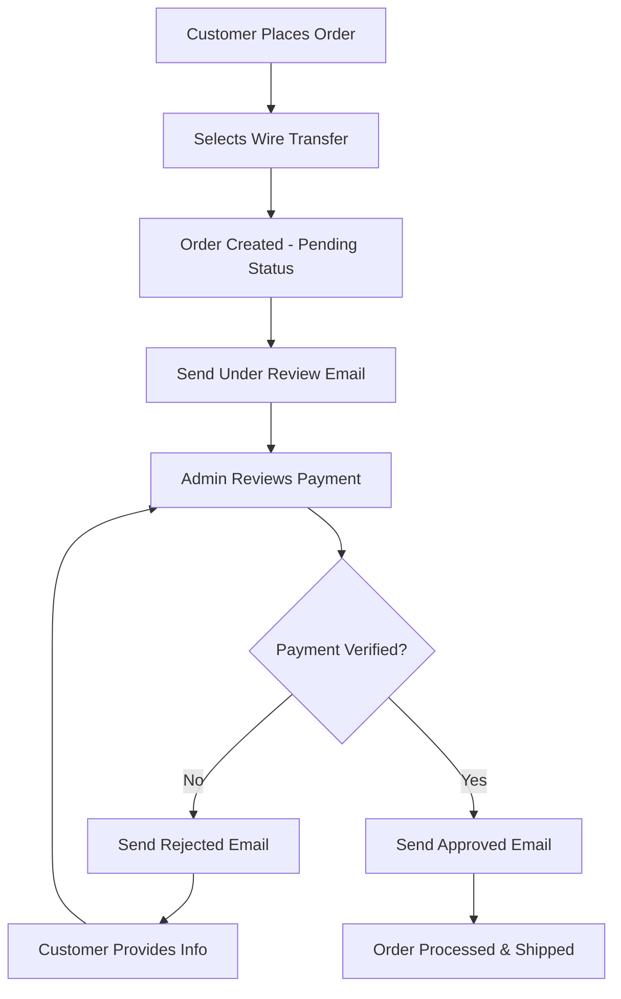

# Wire Transfer Email Flow Documentation

## Overview

The Wire Transfer Email System provides a comprehensive email workflow for managing wire transfer payments. It includes three distinct email templates that guide customers through different stages of the payment process: under review, rejected, and approved.

## System Architecture

The system consists of a single API endpoint that handles three different email types, each with its own specialized template component.

### Files Structure

```
app/api/emails/wire-transfer/
├── route.js                           # Main API endpoint

components/emails/
├── WireTransferUnderReviewEmail.jsx   # Payment under review template
├── WireTransferRejectedEmail.jsx      # Payment rejected template
└── WireTransferApprovedEmail.jsx      # Payment approved template
```

## Email Types & Flow

### 1. Under Review Email (`under_review`)

**Triggered**: Right after wire transfer payment is received
**Purpose**: Inform customer that payment is being verified
**Visual Theme**: Yellow/Orange (pending status)

### 2. Rejected Email (`rejected`)

**Triggered**: When payment verification fails
**Purpose**: Request additional payment information from customer
**Visual Theme**: Red (urgent action required)

### 3. Approved Email (`approved`)

**Triggered**: When payment is verified and order is confirmed
**Purpose**: Confirm order and provide shipping details
**Visual Theme**: Green (success)

## API Usage

### Endpoint

```
POST /api/emails/wire-transfer
GET /api/emails/wire-transfer?type={email_type}
```

### Request Structure

```javascript
{
  "emailType": "under_review|rejected|approved",
  "orderData": {
    "code": "ORD-12345",
    "customer_name": "John Doe",
    "total": 89.99,
    "order_status": "pending|failed|confirmed",
    "payment_status": "pending|failed|paid",
    "products": [...],
    "ws_products": [...],
    "sub_total": 79.99,
    "tax_amount": 8.00,
    "shipping_amount": 12.00,
    "discount_amount": 10.00,
    "shipping_details": {...}, // Required for approved emails
    "billing_details": {...},
    "created_at": "2024-01-15T10:00:00Z"
  },
  "recipientEmail": "customer@example.com",
  "recipientName": "John Doe",
  "transactionDetails": {
    "transactionId": "TXN-789123456",
    "method": "Wire Transfer",
    "date": "2024-01-15T10:00:00Z",
    "trackingNumber": "TRK-WT-001234" // Optional, for approved emails
  }
}
```

## Implementation Examples

### 1. Under Review Email

```javascript
const sendUnderReviewEmail = async (orderData, customerEmail) => {
  const response = await fetch('/api/emails/wire-transfer', {
    method: 'POST',
    headers: { 'Content-Type': 'application/json' },
    body: JSON.stringify({
      emailType: 'under_review',
      orderData: {
        ...orderData,
        order_status: 'pending',
        payment_status: 'pending',
      },
      recipientEmail: customerEmail,
      recipientName: orderData.customer_name,
      transactionDetails: {
        transactionId: orderData.transaction_id,
        method: 'Wire Transfer',
        date: new Date().toISOString(),
      },
    }),
  });

  return await response.json();
};
```

### 2. Rejected Email

```javascript
const sendRejectedEmail = async (orderData, customerEmail) => {
  const response = await fetch('/api/emails/wire-transfer', {
    method: 'POST',
    headers: { 'Content-Type': 'application/json' },
    body: JSON.stringify({
      emailType: 'rejected',
      orderData: {
        ...orderData,
        order_status: 'failed',
        payment_status: 'failed',
      },
      recipientEmail: customerEmail,
      recipientName: orderData.customer_name,
      transactionDetails: {
        transactionId: orderData.transaction_id,
        method: 'Wire Transfer',
        date: new Date().toISOString(),
      },
    }),
  });

  return await response.json();
};
```

### 3. Approved Email

```javascript
const sendApprovedEmail = async (orderData, customerEmail, trackingNumber) => {
  const response = await fetch('/api/emails/wire-transfer', {
    method: 'POST',
    headers: { 'Content-Type': 'application/json' },
    body: JSON.stringify({
      emailType: 'approved',
      orderData: {
        ...orderData,
        order_status: 'confirmed',
        payment_status: 'paid',
      },
      recipientEmail: customerEmail,
      recipientName: orderData.customer_name,
      transactionDetails: {
        transactionId: orderData.transaction_id,
        method: 'Wire Transfer',
        date: new Date().toISOString(),
        trackingNumber: trackingNumber, // Optional
      },
    }),
  });

  return await response.json();
};
```

## Email Template Features

### Common Features (All Templates)

- **Responsive Design**: Works across all email clients and devices
- **Brand Consistency**: Loud Spectrum gradient logo and color scheme
- **Professional Typography**: Space Grotesk font with fallbacks
- **Order Details**: Complete product listing with pricing breakdown
- **Transaction Information**: Payment method and transaction ID display
- **Action Buttons**: Clear CTAs for next steps
- **Footer Branding**: Company information and contact details

### Under Review Email Specific

- **Status Indicators**: Yellow theme indicating pending status
- **Reassurance Messaging**: Clear communication about verification process
- **Timeline Expectations**: Information about review completion
- **Support Contact**: Easy access to customer service

### Rejected Email Specific

- **Urgent Styling**: Red theme indicating action required
- **Detailed Instructions**: Step-by-step guidance for resolution
- **Information Requirements**: Clear list of needed documentation
- **Direct Support Link**: Pre-filled email for customer support
- **Apology Messaging**: Professional acknowledgment of inconvenience

### Approved Email Specific

- **Success Styling**: Green theme indicating completion
- **Shipping Information**: Complete delivery details and tracking
- **Order Confirmation**: Full order summary with payment confirmation
- **Thank You Messaging**: Appreciation and future engagement

## Integration Workflow

### Typical Wire Transfer Process



### Code Integration Example

```javascript
// In your order processing system
class WireTransferProcessor {
  async processWireTransfer(orderData) {
    try {
      // 1. Create order with pending status
      const order = await this.createOrder({
        ...orderData,
        payment_status: 'pending',
        order_status: 'pending',
      });

      // 2. Send under review email
      await this.sendUnderReviewEmail(order);

      return { success: true, orderId: order.id };
    } catch (error) {
      console.error('Wire transfer processing failed:', error);
      return { success: false, error: error.message };
    }
  }

  async verifyPayment(orderId, verificationResult) {
    const order = await this.getOrder(orderId);

    if (verificationResult.approved) {
      // Update order status
      await this.updateOrder(orderId, {
        payment_status: 'paid',
        order_status: 'confirmed',
      });

      // Send approved email
      await this.sendApprovedEmail(order, verificationResult.trackingNumber);
    } else {
      // Send rejected email
      await this.sendRejectedEmail(order);
    }
  }
}
```

## Environment Variables

Required environment variables for the email system:

```env
# Resend Configuration
RESEND_API_KEY=your_resend_api_key
RESEND_FROM_EMAIL=noreply@loudspectrum.com

# Email URLs
NEXT_PUBLIC_BASE_URL_EMAIL=https://yourdomain.com
```

## Error Handling

The API includes comprehensive error handling:

```javascript
// Invalid email type
{
  "error": "Invalid email type. Must be: under_review, rejected, or approved",
  "status": 400
}

// Missing required fields
{
  "error": "Email type, order data, and recipient email are required",
  "status": 400
}

// Email sending failure
{
  "error": "Failed to send email",
  "details": "Specific error details",
  "status": 500
}
```

## Testing

### Preview Templates

```bash
# Preview under review email
GET /api/emails/wire-transfer?type=under_review

# Preview rejected email
GET /api/emails/wire-transfer?type=rejected

# Preview approved email
GET /api/emails/wire-transfer?type=approved
```

### Send Test Emails

```javascript
// Test each email type with sample data
const testEmailTypes = ['under_review', 'rejected', 'approved'];

for (const emailType of testEmailTypes) {
  const response = await fetch('/api/emails/wire-transfer', {
    method: 'POST',
    headers: { 'Content-Type': 'application/json' },
    body: JSON.stringify({
      emailType,
      orderData: sampleOrderData,
      recipientEmail: 'test@example.com',
      recipientName: 'Test User',
      transactionDetails: sampleTransactionDetails,
    }),
  });

  console.log(`${emailType} email:`, await response.json());
}
```

## Best Practices

### 1. Email Timing

- **Under Review**: Send immediately after payment submission
- **Rejected**: Send within 24 hours of verification failure
- **Approved**: Send immediately after verification success

### 2. Data Validation

- Always validate required fields before sending
- Ensure order data is complete and accurate
- Verify email addresses are valid

### 3. Customer Experience

- Keep messaging clear and professional
- Provide specific next steps in each email
- Include support contact information
- Set proper expectations for timing

### 4. Error Handling

- Log all email sending attempts
- Implement retry logic for failed sends
- Monitor email delivery rates
- Have fallback communication methods

## Customization

### Styling Modifications

Update the Tailwind config in each email component to modify colors, fonts, or spacing.

### Content Changes

Modify text content directly in the email components while maintaining the overall structure.

### Additional Data

Extend the `transactionDetails` or `orderData` objects to include additional information as needed.

### Branding Updates

Update logo URLs, company information, and contact details in the footer sections.

## Monitoring & Analytics

Consider implementing:

- Email open rate tracking
- Click-through rate monitoring
- Customer response time analysis
- Support ticket correlation with email types

This comprehensive email system provides a professional, user-friendly experience for wire transfer payments while maintaining consistency with your brand and providing clear communication throughout the payment verification process.
